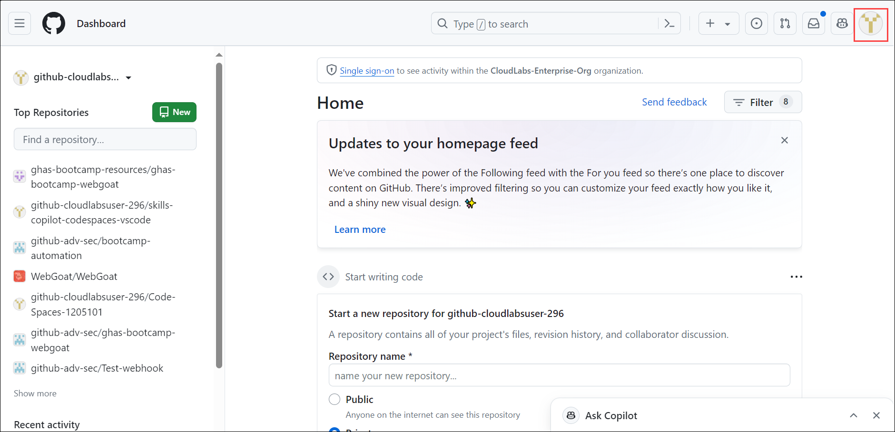
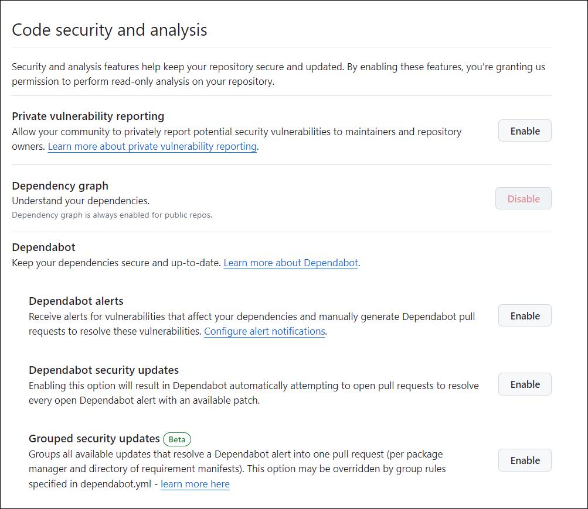
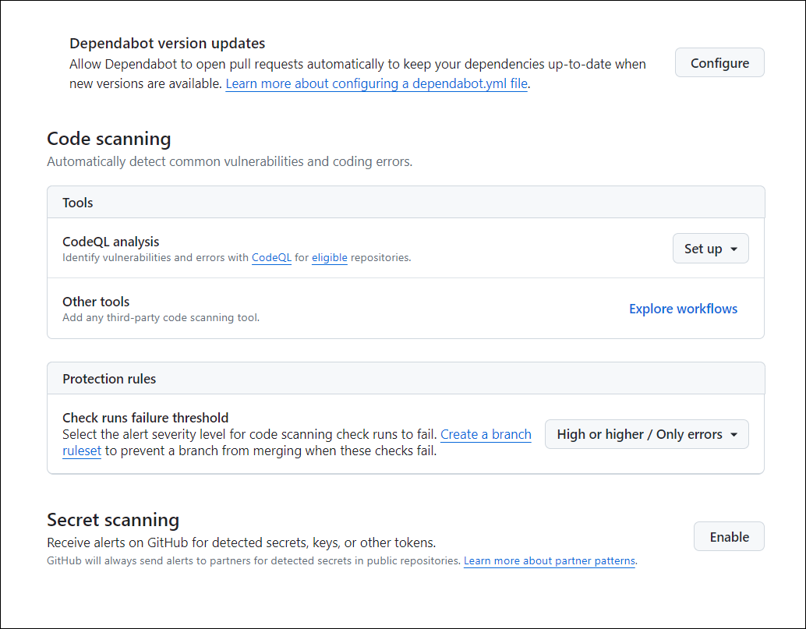
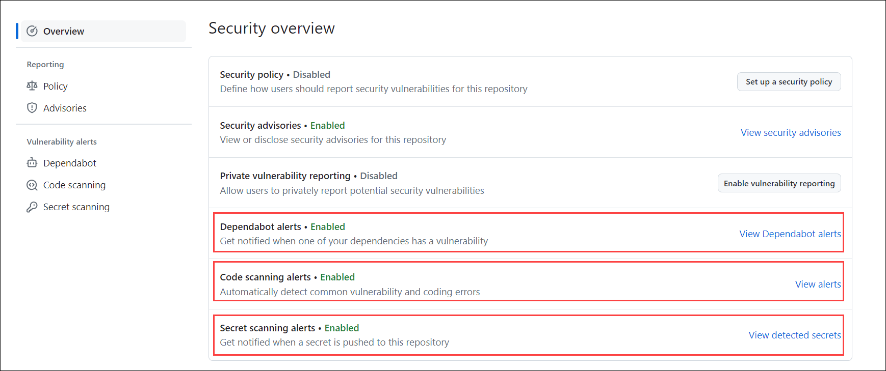

# Module 01: GitHub Advanced Security Overview [Read-Only]

## Lab Scenario

The lab scenario provides an overview of GitHub Advanced Security (GHAS) and its key components, along with instructions on how to enable them in a GitHub repository.

## Lab Objectives
In this lab, you will perform:

- Task 1: What is GitHub Advanced Security? 
- Task 2: What are the components of GitHub Advanced Security?  
- Task 3: Where to turn on the different components of GitHub Advanced Security?  

## Estimated Timing: 20 minutes

## Architecture Diagram

   

### Task 1: What is GitHub Advanced Security?

GitHub Advanced Security is an integrated security suite tailored to enhance your GitHub repositories against potential threats, vulnerabilities, and credential leaks without slowing development. It empowers developers with a robust set of tools and features to proactively identify, mitigate, and resolve security issues throughout the development lifecycle. 

### Task 2: What are the components of GitHub Advanced Security?  
Here are some of the components of GitHub Advanced Security:

1. **Secret Scanning:** Secret scanning is a crucial security feature within GitHub Advanced Security designed to identify and mitigate the inadvertent exposure of sensitive information, such as API keys and tokens within the source code.

    This scanning process is essential for preventing unauthorized access and safeguarding confidential data. Secret scanning operates by searching for predefined patterns and signatures indicative of sensitive information, ensuring that potential security risks are promptly addressed. By default, secret scanning looks for highly accurate patterns that have been provided by a GitHub partner. However, custom patterns can be created for other use cases. We can define custom patterns to identify secrets that are not detected by the default patterns supported by secret scanning. We can define custom patterns for our enterprise, organization, or repository.

   **Secret scanning includes:**
    - Push protection proactively prevents secret leaks by scanning code on commits and blocking a push if a secret is present.
    - The ability to easily view alerts and remediate them.

1. **Code Scanning:** Code scanning is an integral feature of GHAS that analyzes source code for security vulnerabilities and coding errors. It employs static analysis techniques to identify potential issues such as SQL injection, cross-site scripting, and buffer overflows. By providing automated feedback directly within the pull request workflow, code scanning enables developers to address vulnerabilities early in the development process.

    Code scanning enhances the overall security of a software development project by identifying and addressing security vulnerabilities in the codebase before they reach production. By fostering a proactive approach to security, code scanning helps minimize the potential impact of security threats, improves code quality, and accelerates the development cycle by reducing the time spent on post-deployment issue resolution.

1. **Dependabot:** Dependabot is an automated dependency management tool responsible for keeping project dependencies up-to-date. It regularly checks for updates to libraries and frameworks used in a project and automatically opens pull requests to update dependencies to their latest, secure versions. Dependabot contributes to maintaining a secure and stable development environment by addressing vulnerabilities present in outdated dependencies.

    In a secure software development life cycle, managing dependencies is crucial to minimizing the risk of exploiting known vulnerabilities. Dependabot streamlines the process of updating dependencies, ensuring that projects benefit from the latest security patches and improvements. By automating this aspect of security, Dependabot contributes to creating a resilient and secure foundation for the entire development process.

    With GitHub Advanced Security, Dependabot’s functionality is extended to include dependency review. Thus allowing you to check for vulnerable dependencies within a pull request. Also, this check enables you to address vulnerabilities before they are merged into a shared branch.

### Task 3: Where to turn on the different components of GitHub Advanced Security?  

1. On the **Home** page, click on your **profile** on top of the right hand.

    

1. Select **Your organizations**.

    

1. Select **github-bootcamp-cloudlabsaiuser-####** from organizations.

    

1. Click on the **Repositories** and select any repositories.

    

1. In your repository, and click on **Settings**.

   

1. In the left sidebar, click on **Code security & analysis**.

1. Optionally, enable or disable a feature for repositories.

   
   

1. To review, navigate to your repository’s Security tab.

   

1. Here, you can review your alerts in the security overview.

   
   
Please feel free to go through the links for further understanding:[GitHub Advanced Security](https://docs.github.com/en/get-started/learning-about-github/about-github-advanced-security) and [Spot Light on GitHub Advanced Security](https://developer.microsoft.com/en-us/reactor/series/S-1311/?wt.mc_id=promotional_S-1311_email_reactor)

## Review
 
In this lab, you have completed the following:
+ What is GitHub Advanced Security?
+ What are the components of GitHub Advanced Security?
+ Where to turn on the different components of GitHub Advanced Security? 
