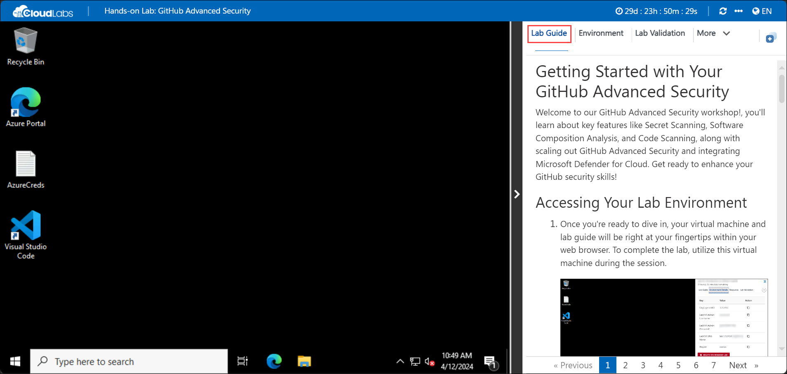
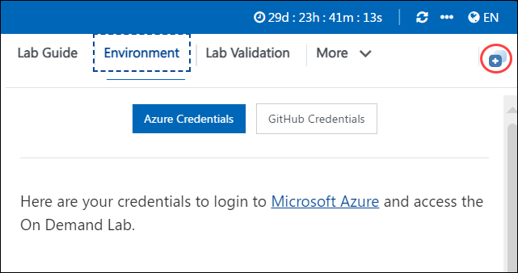
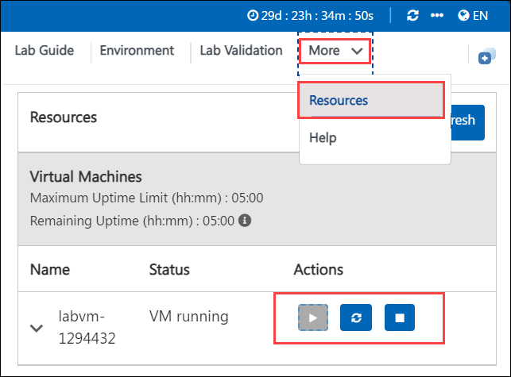
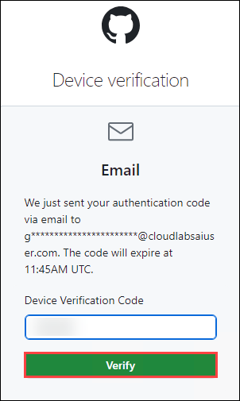

# Getting Started with Your GitHub Advanced Security

Welcome to our GitHub Advanced Security workshop!, you'll learn about key features like Secret Scanning, Software Composition Analysis, and Code Scanning, along with scaling out GitHub Advanced Security and integrating Microsoft Defender for Cloud. Get ready to enhance your GitHub security skills!

## Accessing Your Lab Environment
 
Once you're ready to dive in, your virtual machine and lab guide will be right at your fingertips within your web browser. To complete the lab, utilize this virtual machine during the session.
 
   

### Virtual Machine & Lab Guide
 
Your virtual machine is your workhorse throughout the workshop. The lab guide is your roadmap to success.

## Exploring Your Lab Resources
 
To get a better understanding of your lab resources and credentials, navigate to the **Environment Details** tab.

   

      

## Utilizing the Split Window Feature
 
For convenience, you can open the lab guide in a separate window by selecting the **Split Window** button from the top right corner.
 

 
## Managing Your Virtual Machine
 
1. Feel free to start, stop, or restart your virtual machine as needed from the **Resources** tab. Your experience is in your hands!
 
      

1. Click on **Next** from the bottom right and follow the instructions to perform the lab.

      

1. Feel free to use Zoom in/Zoom out option in your respective browser to view the integrated environment clearly and to get the complete options in GitHub & VS Code.

    

## Login to GitHub

1. In the LABVM desktop, search for **Microsoft Edge** **(1)**, click on **Microsoft Edge** **(2)** browser.

   

   >**Note**: On the Welcome to Microsoft Edge page, select  **Start without your data**, on **Stay current with your browsing data** select **Confirm and continue** and on the help for importing Google browsing data page, select the  **Continue without this data**  button. Then, proceed to select  **Confirm and start browsing**  on the next page
has a context menu.

1. Copy the link and open it in a browser window to log in to GitHub 

   ```
   https://github.com/login
   ```

2. In the sign-in to GitHub page in the Edge browser, enter the **GitHub UserEmail** and **GitHub Password** and click on **Sign in**.

   

   >**Note:** Navigate to the **Environment** tab to view the key-value pairs of the **GitHub Org User**, and **GitHub Org Password**. You can use the copy buttons under the actions column to have the values copied instantly. Alternatively, it is suggested to have the values copied over onto a notepad for easy accessibility. 

    

1. Next, to get the authentication code, sign in to Outlook in the Lab VM through an **inPrivate** window (https://outlook.office365.com/mail/) with the **GitHub** credentials that were copied over to Notepad in the previous step. After logging into Outlook within the Lab Virtual Machine, locate the most recent email that contains the verification code, and then select **Verify** to return to the login screen.

   >**Note:** The email containing the verification code can sometimes creep into the archive/spam folders within your Outlook.
   
   

1. Click "Next" from the bottom right corner to embark on your Lab journey!

   
