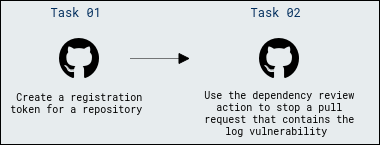
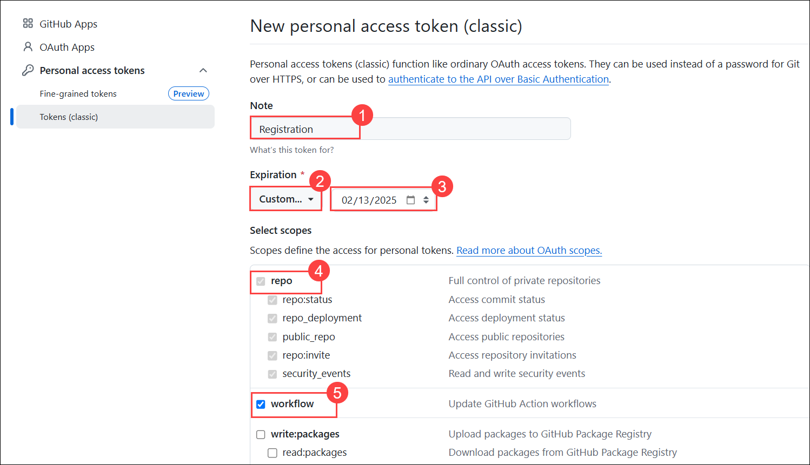
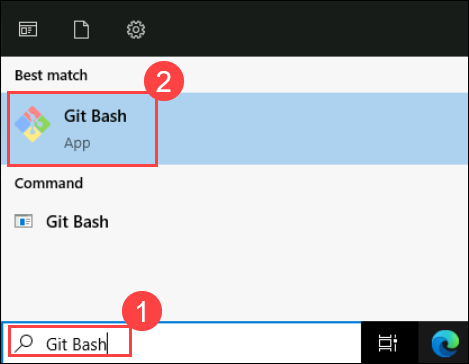
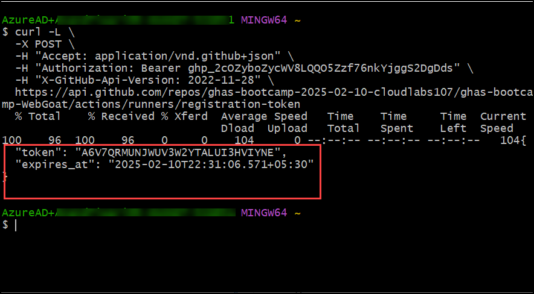
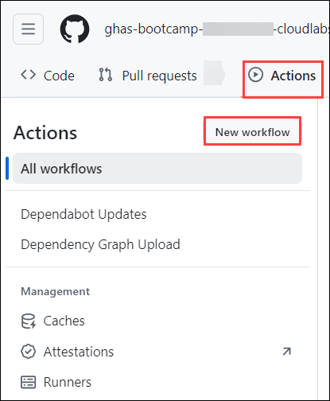
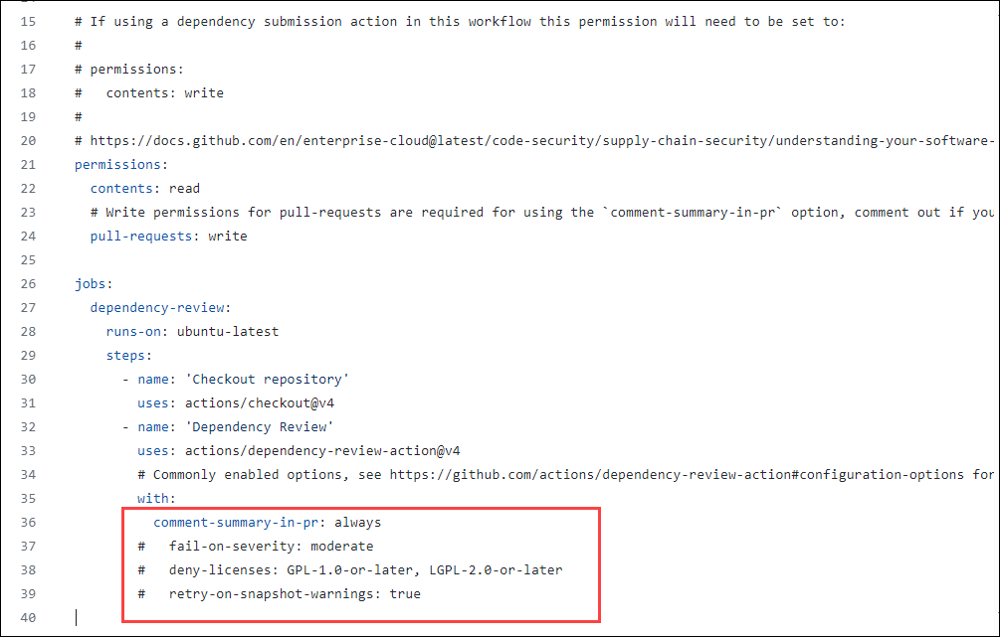
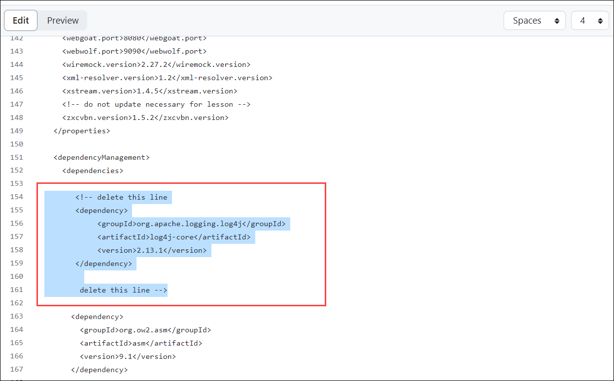
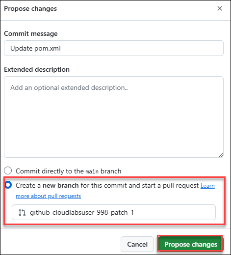
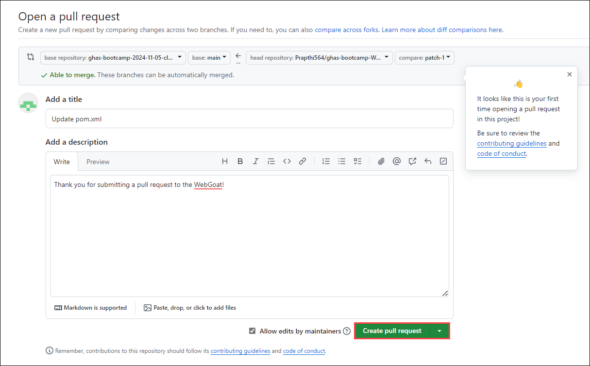
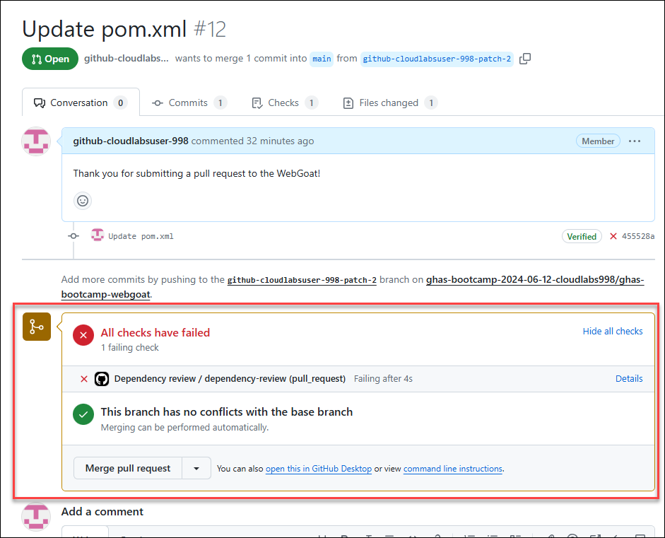

# Module 04: Software Composition Analysis

## Lab Scenario

In this lab, you will be focusing on improving security within your GitHub repositories using Dependabot and Software Composition Analysis (SCA) features.

## Lab Objectives

In this lab, you will perform:

- Task 1:  Create a registration token for a repository 

- Task 2: Use the dependency review action to stop a pull request that contains the log vulnerability. 

## Architecture Diagram



## Estimated Timing: 40 minutes

## Task 1: Create a registration token for a repository

### What is Personal Access Tokens?

Personal access tokens or (PAT) are an alternative to using passwords for authentication to GitHub when using the GitHub API or the command line.

Personal access tokens are intended to access GitHub resources on behalf of yourself. Users can generate PATs in their GitHub account settings and configure the specific permissions and scopes for the token, limiting what actions it can perform.
 
Refer to the link for more information. [Personal Access Tokens](https://docs.github.com/en/authentication/keeping-your-account-and-data-secure/managing-your-personal-access-tokens)

### Why are we using PAT Tokens?

In this lab, Personal Access Tokens (PATs) are used as example secrets to demonstrate how GitHub’s secret scanning and push protection features work. Here’s why PATs are chosen for this exercise:

- **Common Sensitive Data**: PATs are a common type of sensitive data that developers often accidentally commit to repositories. They provide a clear example of the kind of secrets that secret scanning is designed to detect and protect against.

- **Realistic Scenario**: Using PATs creates a realistic scenario. PATs are real credentials that can be used to access GitHub’s API and perform actions on behalf of the user. This makes them a tangible example of how secret scanning prevents unauthorized access.

- **Demonstration of Detection**: By using PATs, you can easily show how secret scanning identifies sensitive information in the codebase. This demonstrates the effectiveness of GitHub's security features in detecting and alerting on potential security risks.

- **Educational Purpose**: PATs are widely understood by developers, making it easier for them to grasp the concept and importance of secret scanning. The exercise involves generating PATs, which helps users learn how to manage and secure their own tokens and other secrets.

  >**Note:** If you haven't already **signed in** to GitHub, proceed to the Getting Started page and complete steps **1** through **4** of the **Login to Github** form.

1. To create a GitHub PAT token, go to your profile on top of the right hand, and then select **Settings**.

   

1. Go to **Developer settings** from the left Navigation pane -> **Personal access tokens (1)** -> **Tokens (classic) (2)**, and then click on **Generate new token (3)** and select **Generate new token (classic) (4)**.

   

1. Give your secret a name **Registration (1)** under *Note* field and set the **Expiration** to **Custom (2)** and select the next calendar day **(3)**. Select the checkboxes for **repo (4)** and **workflow (5)** to grant the necessary permissions, scroll to the bottom and click on **Generate token**. 

   

1. Once you've generated the token, click the **Copy** icon to the right of the secret value.

   

1. In the code below, replace **<Token>** with your generated Personal Access Token (PAT). Additionally, update the organization name to match the required format, which should be similar to `ghas-bootcamp-xxxx-xx-xx-cloudlabsxxx`.

    ```
    curl -L \
    -X POST \
    -H "Accept: application/vnd.github+json" \
    -H "Authorization: Bearer <TOKEN>" \
    -H "X-GitHub-Api-Version: 2022-11-28" \
    https://api.github.com/repos/ghas-bootcamp-xxxx-xx-xx-cloudlabsxxx/ghas-bootcamp-WebGoat/actions/runners/registration-token
    ```

1. In the virtual machine, click on the search bar and type **Git Bash (1)**. From the search results, select and open **Git Bash (2)** to launch the terminal environment.

   

1. Now, paste your code into the terminal and press **Enter**. This will execute the command and send a request to the designated endpoint.

   

## Task 2: Use the dependency review action to stop a pull request that contains the log vulnerability

### Dependency Review Action

The dependency review action is a GitHub Action designed for this purpose, preventing vulnerable dependencies from being merged into a repository. This action serves as a proactive measure to maintain the integrity and security of the repository by identifying and mitigating potential risks associated with third-party dependencies.

1. In the **ghas-bootcamp-webgoat** repo navigate to **Actions**, and in the **Actions**, click on **New workflow** from the left navigation pane.

   

   
 
1. Now, search **Dependency Review** to find and configure the action by clicking the **Configure** button.
   
   

1. In the  `fail-on-severity` in the workflow file and make sure you uncomment the line removing **#** as shown in the below screenshot and click on **Commit Changes** in the top right corner.

   >**Note**: Please ensure that the indentation is correct according to the provided screenshots. Make sure that the **fail-on-severity: low, moderate, high, critical** is directly below the **comment-summary-in-pr: always** line, as shown below:

   >**Note:** The default value of **fail-on-severity** will work as well, but here we demonstrate how to modify your severity level.

   
   

1. If prompted, click on **Commit Changes** once again in the pop-up that appears.

   

1. Now back in the **ghas-bootcamp-webgoat** repository, go to the **pom.xml** file.

   
   
1. Add the provided code to the **WebGoat/pom.xml** file as shown in the screenshot by clicking on the pencil icon and delete the existing lines as mentioned.

   - **Security Vulnerabilities:** Log4j has been known to have critical security vulnerabilities. This vulnerability allowed attackers to execute arbitrary code on a server or other computer running Log4j, leading to severe security risks such as remote code execution.

   - **Impact:** If a project uses a vulnerable version of Log4j, it can be exploited by attackers to compromise the application or the server it runs on. This can lead to unauthorized access, data breaches, and other security issues. 

		```xml
		<dependency>
		   <groupId>org.apache.logging.log4j</groupId>
		   <artifactId>log4j-core</artifactId>
		   <version>2.13.1</version>
		</dependency>
		```

      

      

1. Click on **Commit Changes** and make sure you select **create a new branch** option and click on **Propose Changes** .

   

1. Click on **Create pull request**. 

   

1. On the **Open a pull request** tab, click on **Create pull request**. No need to merge the PR.   

   

1. Scroll down, You will see after few seconds that all the checks got failed due to the dependency review action.

   - **Dependency Review Action:** The Dependency Review action in GitHub Actions is designed to identify and mitigate risks associated with third-party dependencies, including libraries like `Log4j`. When a pull request introduces or updates a dependency, the action checks if the dependency has known vulnerabilities.

   - **Failure of Pull Requests:** If the Dependency Review action detects that a pull request introduces a version of `Log4j` (or any other dependency) that has known vulnerabilities, it will mark the pull request as failed. This is done to prevent merging code that could introduce security risks into the main codebase.

      

1. You can also see the error details on *Actions* section, navigate to **Action** section and from the left navigation pane, click on **Dependency review**. Notice the failed **Dependency review** due to the dependency review finding the introduction of a vulnerable `Log4j` version.

   

<!--
   > **Congratulations** on completing the task! Now, it's time to validate it. Here are the steps:
	
   - Hit the Validate button for the corresponding task. If you receive a success message, you can proceed to the next task.
     >**Note:** Upon clicking the **Validate** button for this exercise, you'll receive a prompt to input your Organization name. Provide your **Organization name** which looks like **ghas-bootcamp-xxxx-xx-xx-cloudlabsxxx**.
    
     >**Note:** Make sure to update the name of your organization, **ghas-bootcamp-xxxx-xx-xx-cloudlabsxxx**.
    
     
   
   - If not, carefully read the error message and retry the step, following the instructions in the lab guide.
   - If you need any assistance, please contact us at cloudlabs-support@spektrasystems.com. We are available 24/7 to help you out.

   <validation step="401a8107-d558-4bed-a5b6-4b1e5ca50132" />
-->

## Review

In this module, we have completed the following:
-  Used the dependency submission action on a Java project
-  Used the dependency review action to stop a Pull Request that contains the log vulnerability
