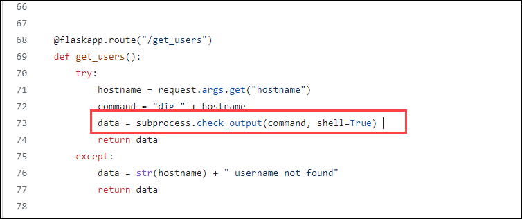
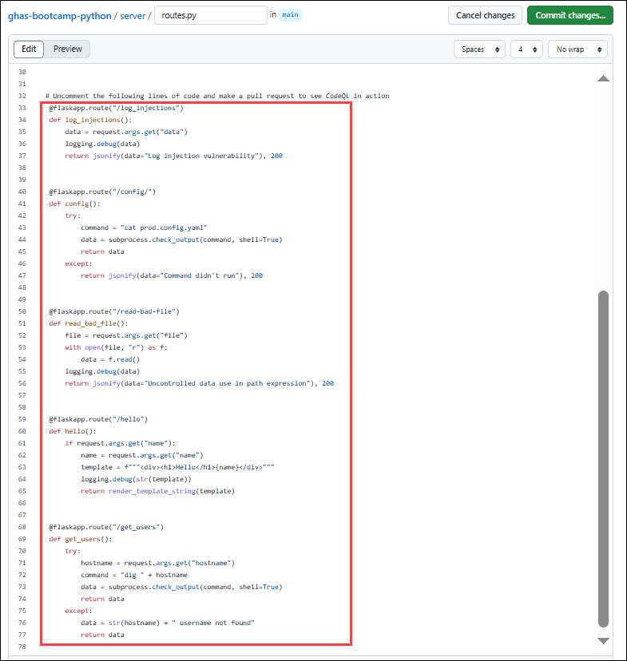
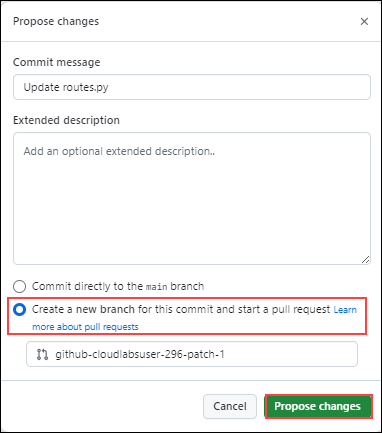
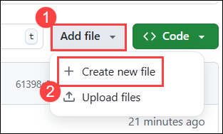
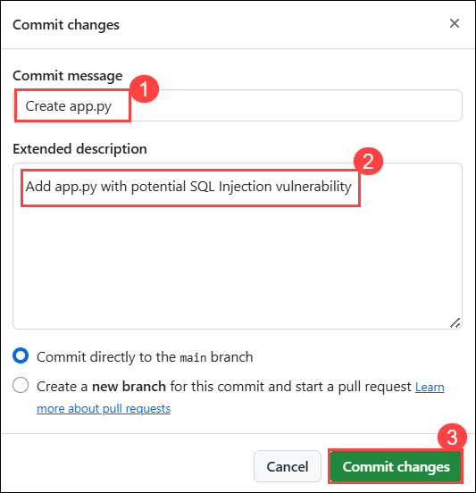
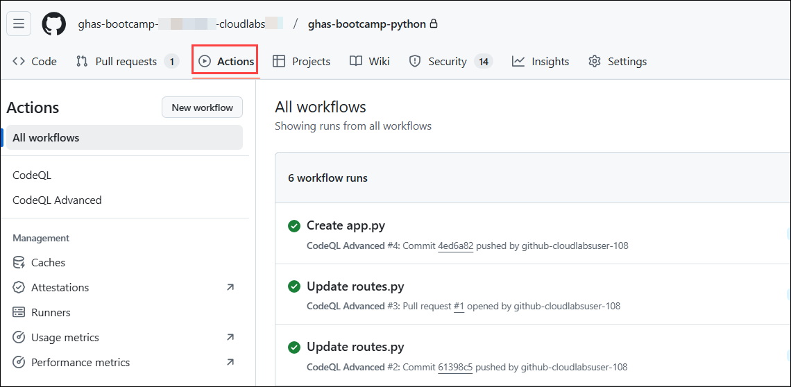
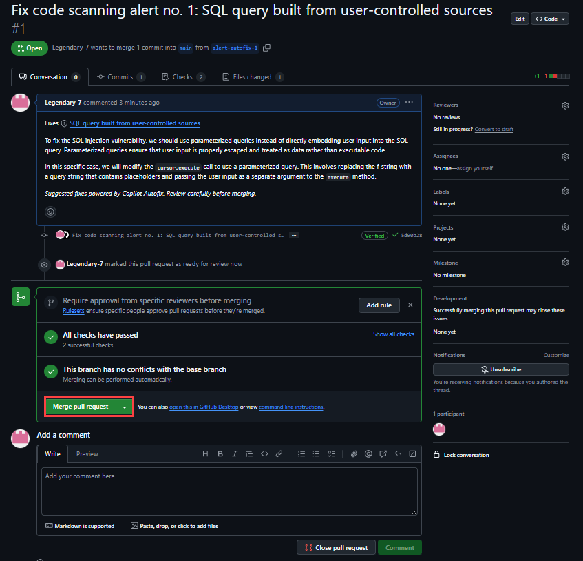

# Module 06: Code Scanning

## Lab Scenario

 In this lab, we'll cover a series of tasks designed to provide a comprehensive understanding of code scanning in GitHub. 

## Lab Objectives

### Implementing GitHub Advanced Security for Your Organization

In this lab, you will learn and perform:

- Task 1: Add some vulnerable code via a pull request and view the scan results in the PR 
- Task 2: Create a code with potencial security vulnerabilities
- Task 3: Run a code scan
- Task 4: Apply autofixes to vulnerabilities

## Estimated timing: 90 minutes
   
## Task 1: Add some vulnerable code via a pull request and view the scan results in the PR  

### Task 1.1: Pull Request scans and Accurate Findings

In this task, you will learn how to enhance CodeQL's security analysis by enabling advanced query configurations and integrating extended security queries. You will gain experience in modifying CodeQL workflows, committing changes related to security vulnerabilities in code, and understanding how CodeQL will accurately identify specific issues, such as clear-text logging of sensitive information, while filtering out less relevant findings. This will depend your understanding of leveraging CodeQL for more precise and effective security scanning in your codebase.

1. In the **ghas-bootcamp-xxxx-xx-xx-cloudlabsxxxx** organization, click on repositories from the top navigation pane.

   

1. From the list of repositories click on **ghas-bootcamp-python** to begin working through this module. This repository should have at least 2 code scanning findings with the **Default** and the **Extended** setup in this repository.

   

1. In the **Code** tab of the Python repository, navigate to the server folder to open the `routes.py` file and scroll down to **Line 40**.

   
  
1. Notice that this part of the code is related to the vulnerabilities that have to do with SQL.

1. Add a **space** at the end of line 73:
`data = subprocess.check_output(command, shell=True)`.This is necessary to trigger the CodeQL alert for the **user-controlled-sources vulnerability**. Click on **Commit changes**.

   

   

   >**Note:** Uncomment the lines of code by removing **#** from line 33.

      

1. Click on commit to commit these changes to a **new branch** then click on **Propose changes.**  
 
   

1. Open a *Pull request* into the **main** branch, click on **Create pull request.**

   

1. Click on **Create pull request** again.   

   
     
1. It may take a moment for the Action to trigger and the **Merge pull request** button will display green until the Action kicks off.
   
   - CodeQL flag this pull request with a _Query built from user-controlled sources_ finding.

     

      

Refer to the link for more information: [Triaging code scanning alerts in pull requests](https://docs.github.com/en/code-security/code-scanning/managing-code-scanning-alerts/triaging-code-scanning-alerts-in-pull-requests)

## Fix code vulnerabilities using Github Copilot Autofix

## Task 2: Create a code with potencial security vulnerabilities

1. Create a new file in the repository **ghas-bootcamp-python**
1. Click on the **Add file (1)** button and select **+ Create new file (2)**.

   

1. Name your file (e.g., app.py).
1. Copy and paste the below code:

   In the new file, write the code that includes potential security vulnerabilities. For example, you can use the following code snippet:
   Python

   ```
   from flask import Flask, request
   import sqlite3
   import os

   app = Flask(__name__)

   def init_db():
      conn = sqlite3.connect(':memory:')
      cursor = conn.cursor()
      cursor.execute("CREATE TABLE user (id INTEGER PRIMARY KEY, name TEXT)")
      cursor.execute("INSERT INTO user (name) VALUES ('Alice')")
      cursor.execute("INSERT INTO user (name) VALUES ('Bob')")
      conn.commit()
      return conn

   conn = init_db()

   @app.route('/user')
   def get_user():
      user_id = request.args.get('id')
      cursor = conn.cursor()
      # Introducing SQL Injection vulnerability
      cursor.execute(f"SELECT name FROM user WHERE id = {user_id}")
      user = cursor.fetchone()
      if user:
         return f"User: {user[0]}"
      else:
         return "User not found", 404

   if __name__ == '__main__':
      debug_mode = os.getenv('FLASK_DEBUG', 'False').lower() in ['true', '1', 't']
      app.run(debug=debug_mode)

   ```

6. Commit the changes:
    - Click on **Commit changes** on the top right corner. 
    - Add a Extended description message describing the changes (e.g., “Add app.py with potential SQL Injection vulnerability”).
    - Choose whether to commit directly to the main branch or create a new branch for this commit.
    - Click on Commit new file to save your changes.

      

7. Verify the file:
Ensure that the file is created and the code is correctly saved in your repository.

## Task 3: Run a code scan

1. In the repository page, navigate to **Actions** tab to view the workflow.

    

2. Check the CodeQL workflow:
   - Look for the CodeQL workflow in the list of workflows.
   - Ensure that the workflow has run automatically after committing the changes.

3. Review the scan results:
   - Click on the latest run of the CodeQL workflow to view the details.
   - Check the results to see if any vulnerabilities were identified.

      

     > Note: Ensure that the CodeQL scan completes successfully and identifies any vulnerabilities.

## Task 4: Apply autofixes to vulnerabilities

1. Navigate to the Security tab in your repository, and then click on Code scanning.

1. Review the list of vulnerabilities and click on an alert to view details.

    

3. If an autofix is available, click on Generate fix to automatically apply the suggested fix.

    

4. Click on **Commit to new branch** and Commit the changes to your repository.

    

5. Make sure to merge and pull the request.

    

6. Autofix generates an updated text, just click confirm merge

    

   > Note: Ensure that the autofixes are applied successfully and the vulnerabilities are resolved.

## Review

In this lab you have completed the following:

- Learned how CodeQL is different from other static analysis tools
- Added some vulnerable code via a pull request and viewed the scan results in the PR.
- Create a code with potencial security vulnerabilities
- Run a code scan
- Apply autofixes to fix code vulnerabilities
