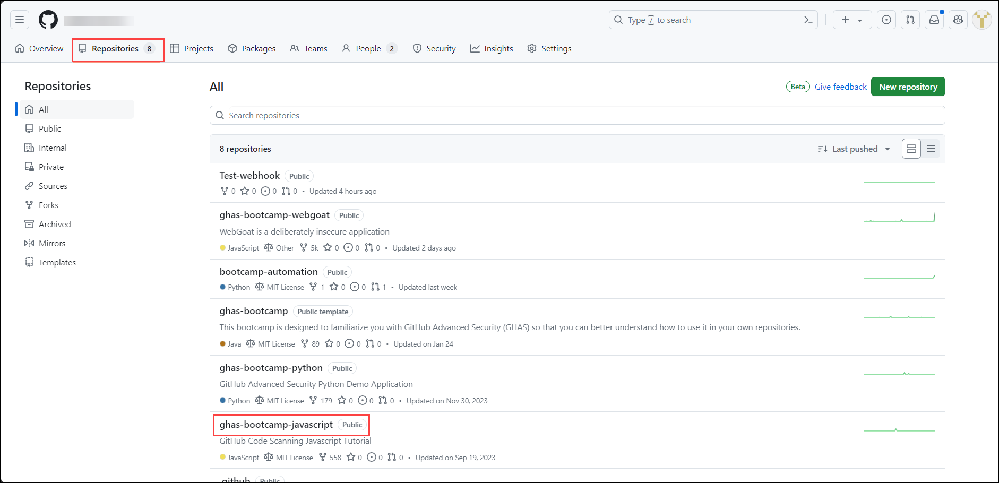
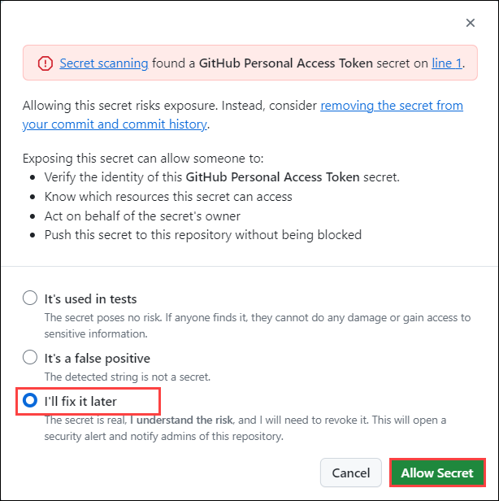

# Module 02: Secret Scanning

## Lab Scenario

This lab guides users through enabling GitHub Secret Scanning for an organization, implementing push protection, creating custom secret patterns, and understanding the scanning results. By simulating the addition of GitHub Personal Access Tokens to repositories, users witness how secret scanning identifies and blocks active secrets, emphasizing the importance of securing sensitive information within codebases. Through practical exercises, users gain insights into the role of secret scanning in mitigating security risks and maintaining the integrity of repositories.

## Lab Objectives
In this lab, you will perform:

- Task 1: Turn on secret scanning for the entire organization. Review results
- Task 2: Turn on push protection and try pushing a new secret (GitHub token) in a repository
- Task 3: Create a custom secret pattern and view the results 
- Task 4: Understanding the results 

### Estimated timing: 60 minutes

## Task 1: Turn on secret scanning for the entire organization. Review results

## What is Secret Scanning?

In GitHub, secrets are any authentication credentials—like tokens or private keys—you might be using in a project to connect to an external service. If you commit a secret into a repository, anyone with read access to the repository can use it to access the external service with your privileges. That's where secret scanning comes into play.

Secret scanning is a GitHub Advanced Security feature that scans repositories for known types of secrets. It prevents the fraudulent use of secrets that were committed accidentally.

Secret scanning automatically scans your entire Git history on all branches present in your GitHub repository for any secrets. When a secret with a known pattern is committed into a private or public repository in your project, secret scanning sends a notification to all repository administrators about the commit that contains the secret. Repository administrators can then view the list of all detected secrets in the Security tab of the repository.

1. To create a GitHub PAT token, go to your profile on top of right hand, and then select **Settings**.

   

1. Go to **Developer settings** -> **Personal access tokens (1)** -> **Tokens (classic) (2)** and then clicking on **Generate new token (3)** at the top and selecting **Generate new token (classic) (4)**

   

1. Give your secret a name **Secret scanning** and set the **Expiration** to _"Custom..."_ and select the next calendar day. By default, no permissions are granted so scroll to the bottom and click **Generate token**. Once you've generated the token, click the "Copy" icon to the right of the secret value.

   

     

1. Go to your profile on top of right hand, and then select **Your organizations**.

    

1. Select **github-adv-sec** from organizations.

    

1. Click on the **Repositories** and select **ghas-bootcamp-javascript**.

    

1. Open _index.js_ file and click the pencil icon on the top-right of the code block to edit it and add ` var secret = "Your-Secret-Value"` to the code, click on **Commit changes**.

   

       

   >**Note:** Replace "Your-Secret-Value" with the secret value copied in the previous step. 

1. Commit this to the default branch (Click on I'll fix this later if asked), and then **navigate to the Security -> Secret Scanning** section to show how this is an active secret.

       

   
   
    >**Note:** that it may take a moment for this secret to be discovered, and the commit author will receive an email once it has been found (as long as you are not ignoring the repository in your watch settings).

1. From here, go back to your profile, and then **Settings** -> **Developer settings** -> **Personal access tokens** -> **Tokens (classic)** and delete the secret you just pasted into the `ghas-bootcamp-javascript` repository. Once you've completed this step, go back to the **Security** -> **Secrets Scanning** section and review that the secret is now identified as a _"Possibly active secret"_.

   

## Task 2: Turn on push protection and try pushing a new secret (GitHub token) in a repository

1. Go to the `ghas-bootcamp-javascript` repository and enable Push Protection. Go to **Settings** -> **Code Security and Analysis** -> scroll down to **Push protection** and click **Enable**.

   

   

   >**Note**: If its already enable then no need to change.

1. After this is enabled, we are going to go back through the process of creating a secret and pasting it into the codebase. Once again go to your profile, and then **Settings** -> **Developer settings** -> **Personal access tokens** -> **Tokens (classic)** and then clicking on **Generate new token** at the top and selecting **Generate new token (classic)**.

1. Once again go to your profile, on top of right hand and then select **Settings**.

   

1. Go to **Developer settings** -> **Personal access tokens (1)** -> **Tokens (classic) (2)** and then clicking on **Generate new token (3)** at the top and selecting **Generate new token (classic) (4)**

   

1. From here, give your secret a name **secret2** and set the **Expiration** to _"Custom..."_ and select the next calendar day. By default, no permissions are granted so it is safe to scroll to the bottom and click **Generate token**.

   

1. Once you've generated the token, click the "Copy" icon to the right of the secret value.

     

1. Return to the `ghas-bootcamp-javascript` repository.
  
1.  Open up _index.js_, click the pencil icon on the top-right of the code block and add `var secret2 = "Your-Secret-Value"` to the code.

    

    >**Note**: Commit the changes with the default options to the to attempt to push the code. This will cause a **secret scanning** pop-up to appear, stopping you from committing your secret to the codebase.

    

10. Select the **It's used in tests** check box and click on **Allow secret** and commit the changes once again to push the code.

    

11. Finally, to show off how much importance we place on catching real secrets over modified / false positive secrets, we will go back through the process of creating a new personal acess token. Once again go to your profile, and then **Settings** -> **Developer settings** -> **Personal access tokens** -> **Tokens (classic)** and then clicking on **Generate new token** at the top and selecting **Generate new token (classic)**.

12. Once again, give your secret a name **secret3** and set the **Expiration** to _"Custom..."_ and select the next calendar day. By default, no permissions are granted so it is safe to scroll to the bottom and click **Generate token**.

13. Once you've generated the token, click the **Copy** icon to the right of the secret value, and return to the `ghas-bootcamp-javascript` repository. Open up _index.js_, click the pencil icon on the top-right of the code block and add `var secret3 = "Your-Secret-Value"` to the code. **BEFORE YOU COMMIT YOUR CODE** go ahead and add some random letters and numbers to the end of the GitHub Personal Access Token you've added.

    

14. In the end, this will _NOT_ cause a **Secret scanning** pop-up to appear. It's important to once-again reiterate that we focus on Push Protecting against secrets that we are highly confident are real, and that match the patterns expected from the algorithms are partners use to generate their credential material.

## Task 3: Create a custom secret pattern and view the results 

1. Within the `ghas-bootcamp-javascript` repo there is a secret disclosed on line 27 of the file `index.js`. To discover secrets like this, we will go into this repository's **Settings** -> **Code Security and Analysis** -> **Secret Scanning** section and then click on the button **New pattern**.

    

1. When creating a new pattern, first supply a name **Test-Pattern(1)** and enter a test string for the pattern **api-password: "gH4#kP!2w_"(5)**. Because writing regular expression patterns can be challenging, we recommend using something like _GitHub Copilot_ or [Regex101.com](https://regex101.com/) to help with this process. You can also refer to the Field Security team's open source [custom-pattern-secrets](https://github.com/advanced-security/secret-scanning-custom-patterns) repository which contains a number of useful examples.

1. Using the [Generic Secrets / Passwords](https://github.com/advanced-security/secret-scanning-custom-patterns/tree/main/generic) from the Field Security team's repository, we grab the following pattern format:

    - ``[a-zA-Z0-9!.,$%&*+?^_`{|}()[\]\\/~-][a-zA-Z0-9\t !.,$%&*+?^_`{|}()[\]\\/~-]*``

    - You will also want to add a couple of values to the **Before secret** and **After secret** values. The following can be used for the **Before Secret(3)**:

    - `(?:\A|[^a-zA-Z0-9])(?i)(?:api|jwt|mysql)?[_.-]?(?:[Pp]ass?(?:wo?r?d|code|phrase)|[Pp]wd|secret)[\t ]*(={1,3}|:)[\t ]*(?:["']|b["'])?`

    - The **After secret(4)** that works in our example is as follows:

    - `(\z|[\r\n'"])`

     

1. Click **Save and dry run** to discover two values of concern - the first being the GitHub Personal Access Token we corrupted earlier, and the second being the `Password123!` value mentioned earlier.

    

1. Click on **Pubish pattern**

    

1. This example captures everything we expect to see in a single repository - which can hold up to 100 patterns. Let's go ahead and apply this to the organization level by going to the `github-adv-sec` and clicking **Settings** -> **Code security and analysis** -> **Secret scanning** and click the green **New pattern** button. Please note that the Organization can hold up to 500 custom patterns.
   
## Task 4: Understanding the results 

In this task, we delve into comprehending the outcomes of secret scanning.

1. We navigated through the repository's findings and demonstrate how Secret Scanning identifies potential vulnerabilities, followed by a practical demonstration of adding a GitHub Personal Access Token (PAT) to the codebase to exemplify Active Secrets detection.

1. After identifying active secrets, we discuss the significance of validity checks in prioritizing remediation efforts.

1. Next, we enable Push Protection in the ghas-bootcamp-javascript repository and simulate attempting to push a new secret.

1. We created  custom secret patterns to uncover specific types of sensitive information.

## Review

In this lab we have completed the following:
 - Turned on secret scanning for the entire organization.
 - Turned on push protection and tried pushing a new secret (GitHub token) in a repository
 - Created a custom secret pattern 
