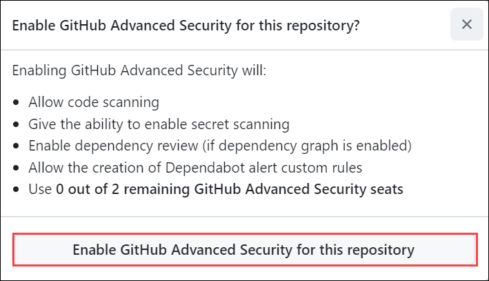
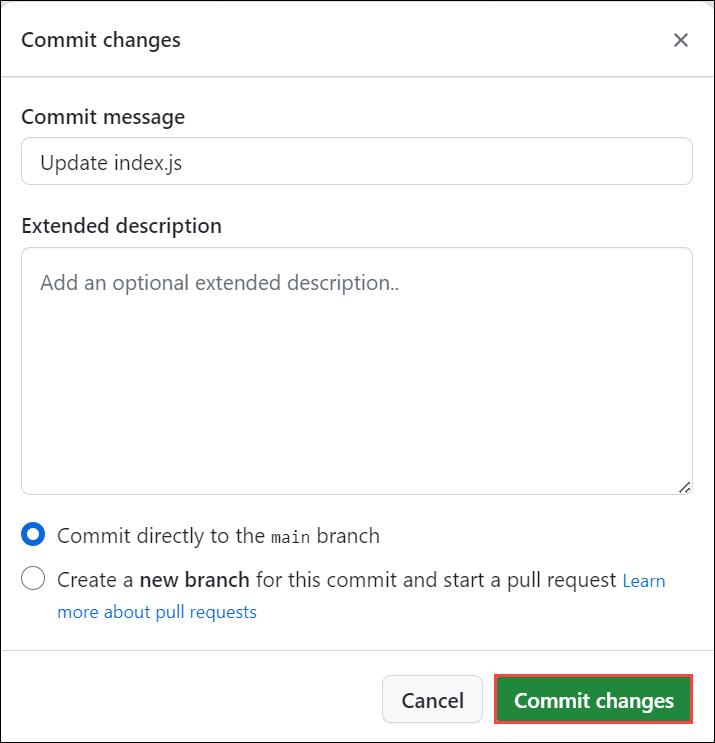
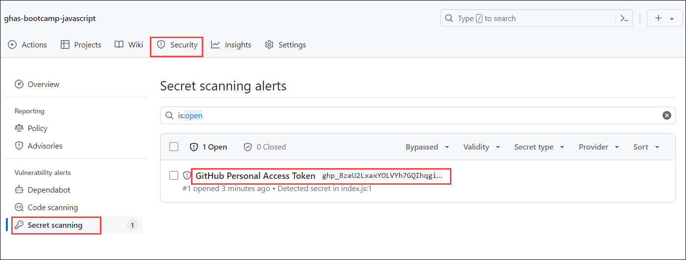
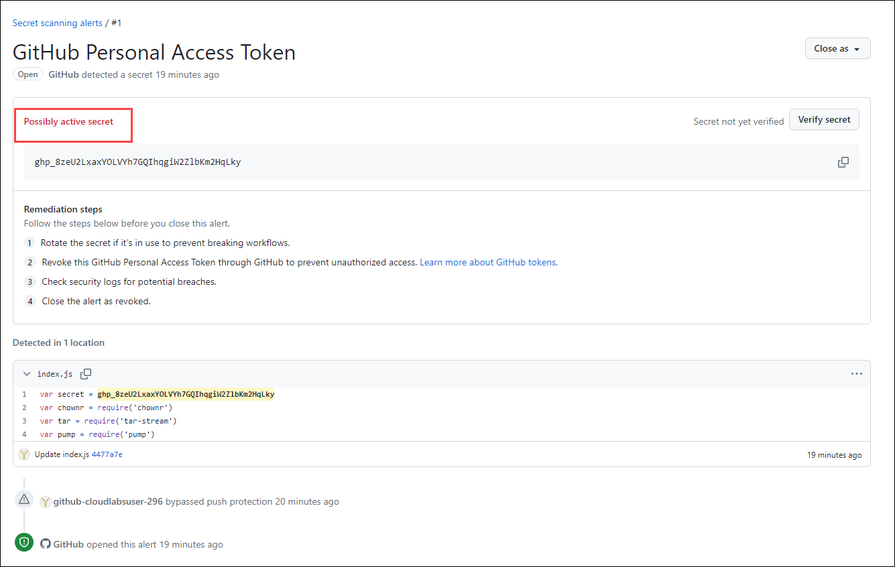
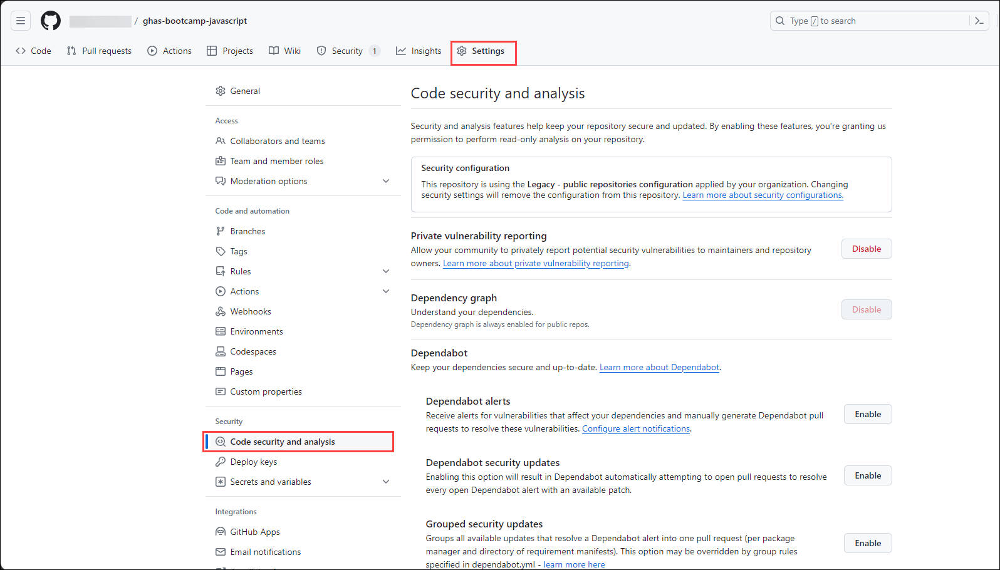
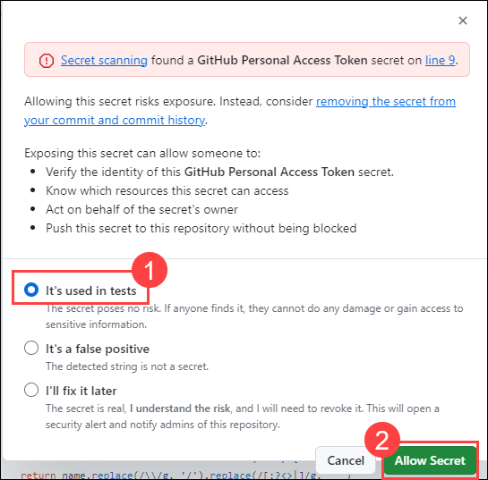
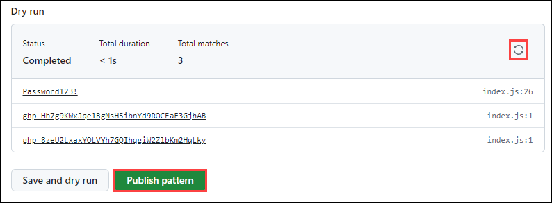

# Module 02: Secret Scanning

## Lab Scenario

This lab guides users through enabling GitHub secret scanning for an organization, implementing push protection, creating custom secret patterns, and understanding the scanning results. By simulating the addition of GitHub Personal Access Tokens to repositories, users witness how secret scanning identifies and blocks active secrets. Thus emphasizing the importance of securing sensitive information within codebases. Through practical exercises, users gain insights into the role of secret scanning in mitigating security risks and maintaining the integrity of repositories.

## Lab Objectives
In this lab, you will perform:

- Task 1: Turn on secret scanning for the entire organization. Review results
- Task 2: Turn on push protection and try pushing a new secret (a GitHub token) into a repository
- Task 3: Create a custom secret pattern and view the results 
- Task 4: Understand the results 

## Estimated Timing: 60 minutes

## Architecture Diagram

   

## Task 1: Turn on secret scanning for the entire organization. Review results

## What is secret scanning?

In GitHub, secrets are any authentication credentials—like tokens or private keys—you might be using in a project to connect to an external service. If you commit a secret to a repository, anyone with read access to the repository can use it to access an external service with your privileges. That's where secret scanning comes into play.

Secret scanning is a GitHub Advanced Security feature that scans repositories for known types of secrets. It prevents the fraudulent use of accidentally committed secrets.

Secret scanning automatically scans your entire Git history on all branches present in your GitHub repository for any secrets. When a secret with a known pattern is committed to a private or public repository in your project, secret scanning notifies all repository administrators about the commit that contains the secret. Repository administrators can then view the list of all detected secrets in the **Security** tab of the repository.

1. To create a GitHub PAT token, go to your profile on top of the right hand, and then select **Settings**.

   

1. Go to **Developer settings** -> **Personal access tokens (1)** -> **Tokens (classic) (2)**, and then click on **Generate new token (3)** at the top and select **Generate new token (classic) (4)**.

   

1. Give your secret a name **Secret scanning**, and set the **Expiration** to **_"Custom..."_** and select the next calendar day. By default, no permissions are granted, so scroll to the bottom and click on **Generate token**. Once you've generated the token, click the **"Copy"** icon to the right of the secret value.

   

     

1. Go to your profile on top of the right hand, and then select **Your organizations**.

    

1. Select **github-bootcamp-cloudlabsaiuser-####** from organizations.

    

1. Click on **Repositories** and select **ghas-bootcamp-javascript**.

    

1. In the ghas-bootcamp-javascript repository navigate to **Settings** from the top navigation pane.

   

1. From the left navigation pane, click on **Code Security and Analysis**.

   

1. Enable **GitHub Advanced Security** option.

   

1. Click on **Enable GitHub Advanced Security for this repository**.
        
   

1. scroll down to **Secret Scanning**, click on **enable**.

   

1. Navigate to **Code** from the top navigation pane.

   
   
1. Open the **_index.js_** file and click the pencil icon at the top-right of the code block to edit it. Add **` var secret = "Your-Secret-Value"`** to the code, and click on **Commit changes**.

   

       

   >**Note:** Replace **"Your-Secret-Value"** with the secret value copied in the previous step.  

1. Commit this to the default branch, and then **navigate to the Security -> Secret Scanning** section to show how this is an active secret.

       

   

   >**Note:** If secret scanning is not enabled in your repository, go to the **Settings** tab in the repository and click on **Code Security and analysis** option from the left navigation pane to view the option.
   
    >**Note:** It may take a moment for this secret to be discovered, and the commit author will receive an email once it has been found (as long as you are not ignoring the repository in your watch settings).

1. Review the secret is identified as  _"Possibly active secret"_.

   

  > **Congratulations** on completing the task! Now, it's time to validate it. Here are the steps:
	
  - Hit the Validate button for the corresponding task. If you receive a success message, you can proceed to the next task. 
  - If not, carefully read the error message and retry the step, following the instructions in the lab guide.
  - If you need any assistance, please contact us at labs-support@spektrasystems.com. We are available 24/7 to help you out.
    
<validation step="48341224-6086-4ce1-a337-9ec19e1e9582" />

## Task 2: Turn on push protection and try pushing a new secret (GitHub token) in a repository

1. Go to the **`ghas-bootcamp-javascript`** repository and enable push protection. Go to **Settings** -> **Code Security and Analysis** -> scroll down to **Push protection** and click **Enable**.

   

   

   >**Note**: If it's already enabled, then there is no need to change it.

1. After this is enabled, we are going to go back through the process of creating a secret and pasting it into the codebase. Once again, go to your profile and then **Settings** -> **Developer settings** -> **Personal access tokens** -> **Tokens (classic)**. Click on **Generate new token** at the top and select **Generate new token (classic)**.

1. Once again, go to your profile, which is at the top of your right hand, and then select **Settings**.

   

1. Go to **Developer settings** -> **Personal access tokens (1)** -> **Tokens (classic) (2)**, and then click on **Generate new token (3)** at the top. Now select **Generate new token (classic) (4)**.

   

1. From here, give your secret a name, **secret2**," set the **Expiration** to **_"Custom..."_** and select the next calendar day. By default, no permissions are granted, so it is safe to scroll to the bottom and click on **Generate token**.

   

1. Once you've generated the token, click on the **"Copy"** icon to the right of the secret value.

     

1. Return to the **`ghas-bootcamp-javascript`** repository.
  
1.  Open up **_index.js_**, click the pencil icon on the top-right of the code block, and add **`var secret2 = "Your-Secret-Value"`** to the code.

    

    >**Note**: Commit the changes with the default options to the attempt to push the code. This will cause a **secret scanning** pop-up to appear, stopping you from committing your secret to the codebase.

    

10. Select the **It's used in tests** check box, click on **Allow secret**, and commit the changes once again to push the code.

    

11. Finally, to show off how much importance we place on catching real secrets over modified / false positive secrets, we will go back through the process of creating a new personal access token. Once again, go to your profile, and then **Settings** -> **Developer settings** -> **Personal access tokens** -> **Tokens (classic)**, and then click on **Generate new token** at the top and select **Generate new token (classic)**.

12. Once again, give your secret a name, **secret3**, set the **Expiration** to **_"Custom..."_** and select the next calendar day. By default, no permissions are granted, so it is safe to scroll to the bottom and click **Generate token**.

13. Once you've generated the token, click the **Copy** icon to the right of the secret value, and return to the **`ghas-bootcamp-javascript`** repository. Open up **_index.js_**, click the pencil icon on the top-right of the code block, and add **`var secret3 = "Your-Secret-Value"`** to the code. **BEFORE YOU COMMIT YOUR CODE**, go ahead and add some random letters and numbers to the end of the GitHub Personal Access Token you've added.

    

14. In the end, this will _NOT_ cause a **Secret scanning** pop-up to appear. It's important to once again reiterate that we focus on push protecting against secrets that we are highly confident about and that are real. They should also match the patterns expected from the algorithms partners use to generate their credential material.

## Task 3: Create a custom secret pattern and view the results 

1. Within the **`ghas-bootcamp-javascript`** repo, there is a secret disclosed on line 27 of the file **`index.js`**. To discover secrets like this, we will go into this repository's **Settings** -> **Code Security and Analysis** -> **Secret Scanning** section and then click on the button **New pattern**.

    

1. When creating a new pattern, first include the name **Test-Pattern(1)** and enter a test string for the pattern **api-password: "gH4$kP!2w_"(5)**. Because writing regular expression patterns can be challenging, we recommend using something like _GitHub Copilot_ or [Regex101.com](https://regex101.com/) to help with this process. You can also refer to the Field Security team's open-source [custom-pattern-secrets](https://github.com/advanced-security/secret-scanning-custom-patterns) repository, which contains several useful examples.

1. Using the [Generic Secrets / Passwords](https://github.com/advanced-security/secret-scanning-custom-patterns/tree/main/generic) from the field security team's repository, we grab the following pattern format:

    - ``[a-zA-Z0-9!.,$%&*+?^_`{|}()[\]\\/~-][a-zA-Z0-9\t !.,$%&*+?^_`{|}()[\]\\/~-]*``

    - Click on the **More options**, You will also want to add a couple of values to the **Before secret** and **After secret** values. The following can be used for the **Before Secret(3)**:

    - `(?:\A|[^a-zA-Z0-9])(?i)(?:api|jwt|mysql)?[_.-]?(?:[Pp]ass?(?:wo?r?d|code|phrase)|[Pp]wd|secret)[\t ]*(={1,3}|:)[\t ]*(?:["']|b["'])?`

    - The **After secret(4)** that works in our example is as follows:

    - `(\z|[\r\n'"])`

     

1. Click **Save and dry run** to discover two values of concern - the first being the GitHub Personal Access Token we corrupted earlier, and the second being the `Password123!` value mentioned earlier.

    

1. Click on **Pubish pattern**.

   

   >**Note:** Please click **reload** if you are unable to see the **Publish pattern**.

1. This example captures everything we expect to see in a single repository, which can hold up to 100 patterns.
   
## Task 4: Understanding the results 

In this task, we delve into comprehending the outcomes of secret scanning.

1. We navigated through the repository's findings and demonstrated how secret scanning identifies potential vulnerabilities, followed by a practical demonstration of adding a GitHub Personal Access Token (PAT) to the codebase to exemplify active secret detection.

1. After identifying active secrets, we discuss the significance of validity checks in prioritizing remediation efforts.

1. Next, we enable push protection in the **ghas-bootcamp-javascript** repository and simulate attempting to push a new secret.

1. We created custom secret patterns to uncover specific types of sensitive information.

Please feel free to go through the documents for further understanding:[Security](https://github.blog/category/security/)

## Review

In this lab, we have completed the following:
 - Turned on secret scanning for the entire organization
 - Turned on push protection and tried pushing a new secret (a GitHub token) into a repository
 - Created a custom secret pattern
 - Understanding the results 
