# Module 03: Software Composition Analysis

## Lab Scenario

In this lab, you will be focusing on improving security within your GitHub repositories using Dependabot and Software Composition Analysis (SCA) features.

## Lab Objectives

In this lab, you will perform:

- Task 1: Turn on Dependabot and other SCA features and review results 
- Task 2: Use the dependency submission action on a Java project and review results 
- Task 3: Use the dependency review action to stop a pull request that contains the log vulnerability. 

## Estimated Timing: 40 minutes

## Architecture Diagram

   

## Task 1: Turn on Dependabot and other SCA features and review results 

1. In the **ghas-bootcamp-xxxx-xx-xx-cloudlabsxxx** organization, click on **Repositories** from the top navigation pane.

   

1. From the list of repositories, click on **ghas-bootcamp-webgoat** to begin working through this module. 

   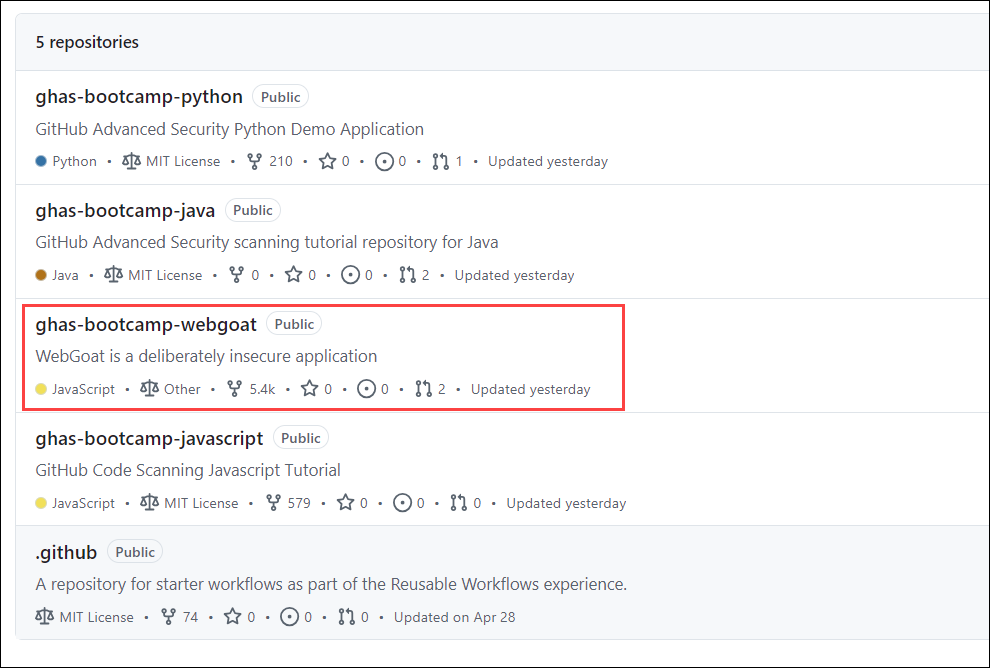

1. In the WebGoat repository navigate to **Settings** from the top navigation pane.

   

1. From the left navigation pane, click on **Code security**.

   

1. Click on the **Enable** option next to **Dependency Graph (1)** if it is not already enabled.

         

   

   > **Note:** By default, the **Dependency Graph** is enabled for public repositories. However, in this environment,if its not appear enabled initially. simply click **Enable** to activate it.

1. Click on **enable** button next to the, **Dependabot Alerts** **(1)**, **Dependabot security updates** **(2)**, **Grouped security updates** **(3)**, and **Dependabot on Actions runners** **(4)**.

   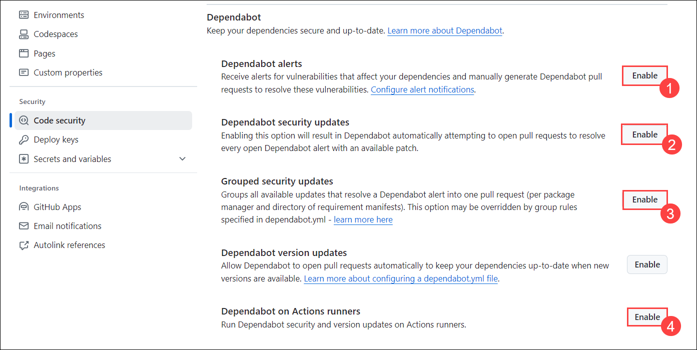

   >**Info:** Dependabot raises Pull requests to update dependencies. Depending on how your repository is configured, Dependabot may raise Pull requests for version updates and/or security updates. You manage these Pull requests in the same way as any other pull request.

1. Now you can check the Pull requests that are automatically getting triggered through the Depandabot by navigating to the **Security** tab from the top menu and under **Vulnerabilities** click on **Dependabot**. Notice the pull requests that were triggered automatically in the repository.

   >**Note:** The number of dependency alerts can be differ for you as it takes some time to scan the whole repositry. 

   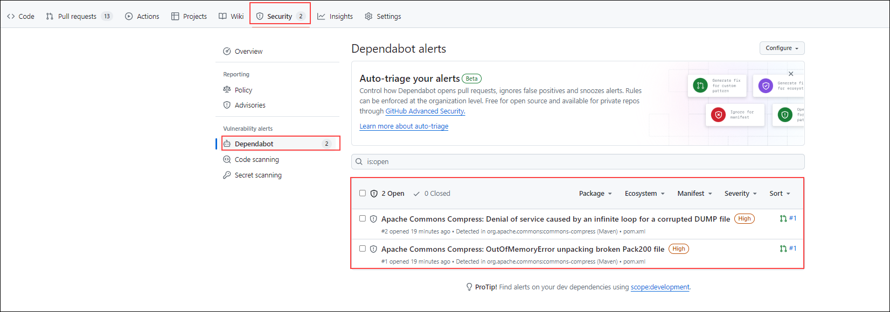
   
   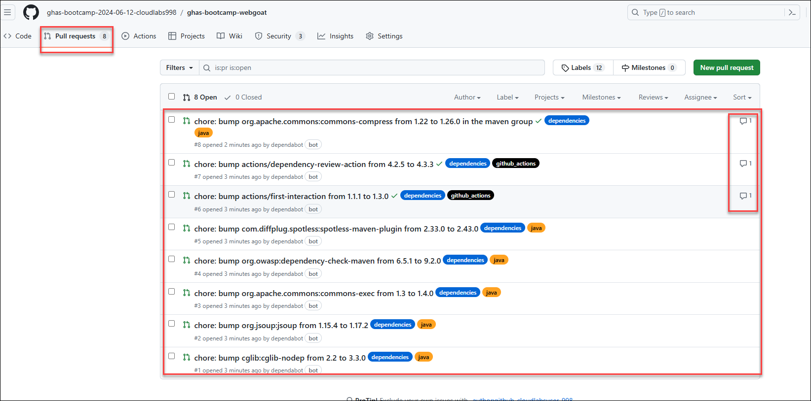

## Task 2: Use the dependency submission action on a Webgoat project and review results

GitHub's dependency submission API supports Software Composition Analysis (SCA). It provides a GitHub API that allows uploading a complete list of the dependencies used by a repository (or, more precisely, a particular build of the application in the repository).
The process involves adding all dependencies from a repository to the dependency graph. Particularly those resolved during software compilation or building. Even if they are not listed in a manifest file like pom.xml. When new dependency versions are released, Dependabot utilizes data submitted via the dependency submission API to generate Pull requests.

1. In the **`ghas-bootcamp-webgoat`** repository, navigate to the **`.github/workflows`** directory. Once there, click on **Add file (1)**, then select **+ Create new file (2)** to add a new file to the repository.

   

1. Create a file named **`DepGraph.yml` (1)**. Paste the provided code into the file and click on **Commit changes (2)** to save and commit the new file to the repository.

	  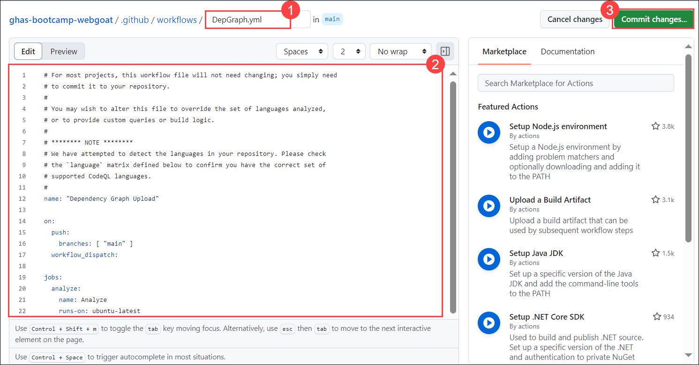
	
	  ```
	   
	   # For most projects, this workflow file will not need changing; you simply need
	   # to commit it to your repository.
	   #
	   # You may wish to alter this file to override the set of languages analyzed,
	   # or to provide custom queries or build logic.
	   #
	   # ******** NOTE ********
	   # We have attempted to detect the languages in your repository. Please check
	   # the `language` matrix defined below to confirm you have the correct set of
	   # supported CodeQL languages.
	   #
	   name: "Dependency Graph Upload"
	
	   on:
	     push:
	       branches: [ "main" ]
	     workflow_dispatch:
	
	   jobs:
	     analyze:
	       name: Analyze
	       runs-on: ubuntu-latest
	       permissions:
	         actions: read
	         contents: write
	         security-events: write
	
	
	       steps:
	       - name: Checkout repository
	         uses: actions/checkout@v4
	       - name: Maven Dependency Tree Dependency Submission
	         uses: advanced-security/maven-dependency-submission-action@v4
	  ```

1. Click on **Commit changes**.

   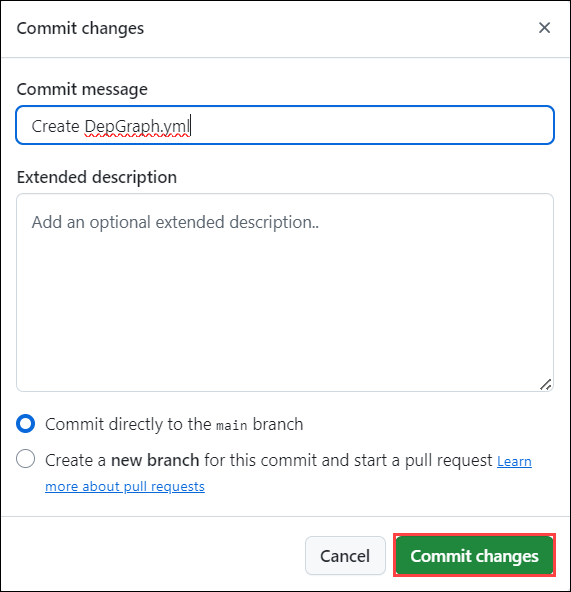

   > **Note:** This will trigger the DepGraph.yml file to run a new worflow named **Dependency Graph Upload**.

1. This explains how this file will use the **Maven Dependency Tree Submission** action to identify the transitive dependencies. Transitive dependencies are pulled in as part of the build process for this project.

1. Go to the **Actions** section from the top navigation pane and click on the **Dependency Graph Upload** action from the left navigation pane.

   
 
1. Once this is completed, go to the **Dependency Graph** tab under the **Insights** section in the top navigation pane.

   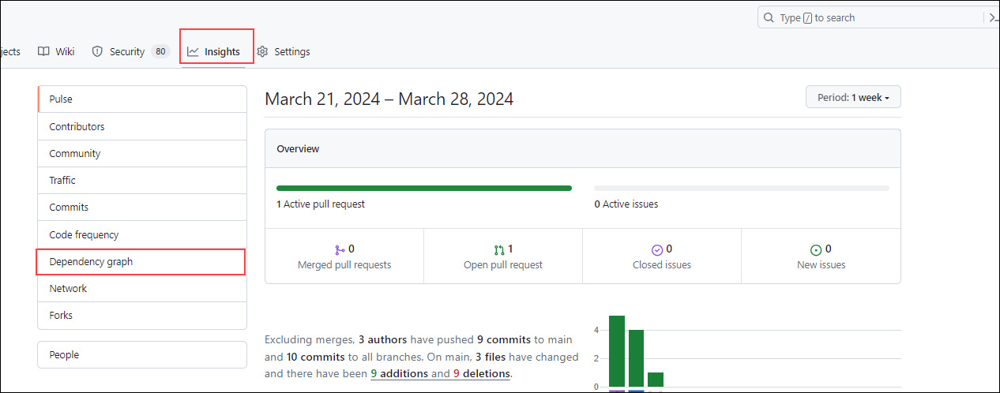

1. This will show the new critical vulnerabilities that have been identified in transitive dependencies.

   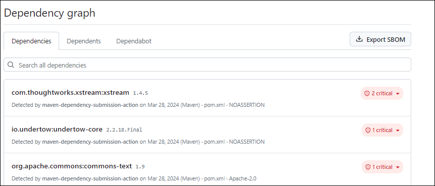

## Task 3: Use the dependency review action to stop a pull request that contains the log vulnerability

## Dependency Review Action

The dependency review action is a GitHub Action designed for this purpose, preventing vulnerable dependencies from being merged into a repository. This action serves as a proactive measure to maintain the integrity and security of the repository by identifying and mitigating potential risks associated with third-party dependencies.

1. In the **ghas-bootcamp-webgoat** repo navigate to **Actions**, and in the **Actions**, click on **New workflow** from the left navigation pane.

   

   
 
1. Now, search **Dependency Review** to find and configure the action by clicking the **Configure** button.
   
   

1. In the  `fail-on-severity` in the workflow file and make sure you uncomment the line removing **#** as shown in the below screenshot and click on **Commit Changes** in the top right corner.

   >**Note**: Please ensure that the indentation is correct according to the provided screenshots. Make sure that the **fail-on-severity: low, moderate, high, critical** is directly below the **comment-summary-in-pr: always** line, as shown below:

   >**Note:** The default value of **fail-on-severity** will work as well, but here we demonstrate how to modify your severity level.

   
   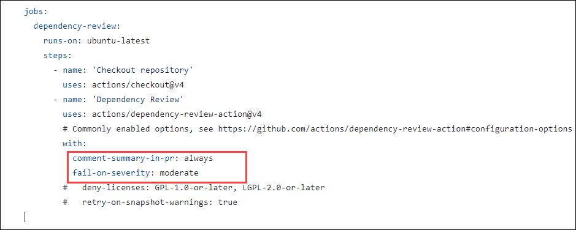

1. Click on **Commit Changes** once again in the pop-up that appears.

   

1. Now back in the **ghas-bootcamp-webgoat** repository, go to the **pom.xml** file.

   
   
1. Add the provided code to the **WebGoat/pom.xml** file as shown in the screenshot and delete the existing lines as mentioned.

   - **Security Vulnerabilities:** Log4j has been known to have critical security vulnerabilities. This vulnerability allowed attackers to execute arbitrary code on a server or other computer running Log4j, leading to severe security risks such as remote code execution.

   - **Impact:** If a project uses a vulnerable version of Log4j, it can be exploited by attackers to compromise the application or the server it runs on. This can lead to unauthorized access, data breaches, and other security issues. 


        ```xml
         <dependency>
           <groupId>org.apache.logging.log4j</groupId>
           <artifactId>log4j-core</artifactId>
           <version>2.13.1</version>
         </dependency>
        ```

        

        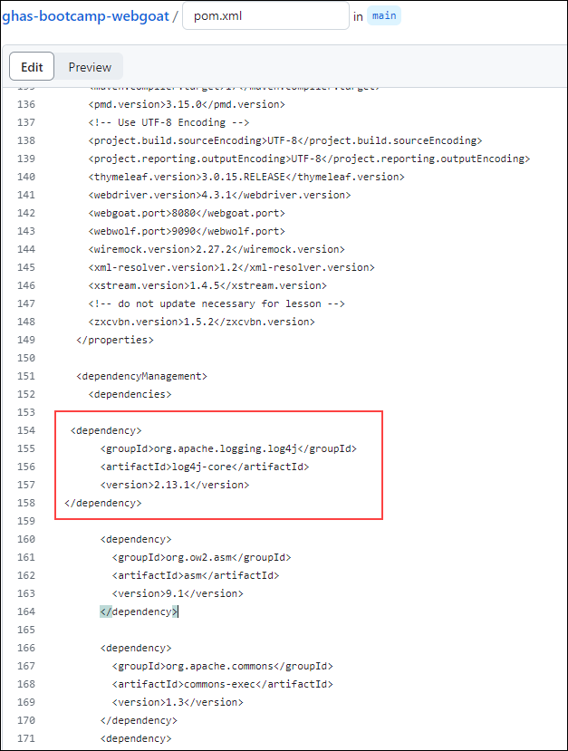

1. Click on **Commit Changes** and make sure you select **create a new branch** option and click on **Propose Changes** .

   

1. On the **Open a pull request** tab, click on **Create pull request**. No need to merge the PR.

   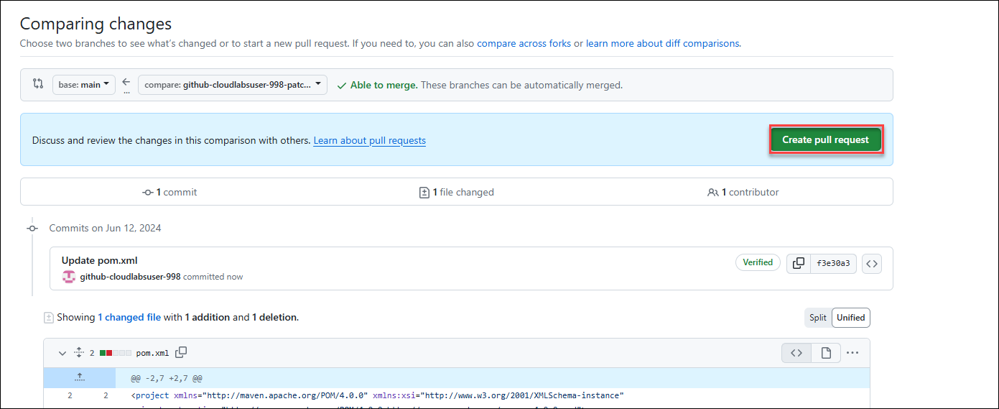

1. You will see after few seconds that all the checks got failed due to the dependency review action.

   - **Dependency Review Action:** The Dependency Review action in GitHub Actions is designed to identify and mitigate risks associated with third-party dependencies, including libraries like `Log4j`. When a pull request introduces or updates a dependency, the action checks if the dependency has known vulnerabilities.

   - **Failure of Pull Requests:** If the Dependency Review action detects that a pull request introduces a version of `Log4j` (or any other dependency) that has known vulnerabilities, it will mark the pull request as failed. This is done to prevent merging code that could introduce security risks into the main codebase.

      

1. You can also see the error details on **Actions** section, navigate to action section and from the left navigation pane, click on **Dependency Review**. Notice the failed **Dependency review** due to the dependency review finding the introduction of a vulnerable `Log4j` version.

   

   > **Congratulations** on completing the task! Now, it's time to validate it. Here are the steps:
	
   - Hit the Validate button for the corresponding task. If you receive a success message, you can proceed to the next task.
     >**Note:** Upon clicking the **Validate** button for this exercise, you'll receive a prompt to input your Organization name. Provide your **Organization name** which looks like **ghas-bootcamp-xxxx-xx-xx-cloudlabsxxx**.
    
     >**Note:** Make sure to update the name of your organization, **ghas-bootcamp-xxxx-xx-xx-cloudlabsxxx**.
    
     
   
   - If not, carefully read the error message and retry the step, following the instructions in the lab guide.
   - If you need any assistance, please contact us at labs-support@spektrasystems.com. We are available 24/7 to help you out.

   <validation step="401a8107-d558-4bed-a5b6-4b1e5ca50132" />

## Review

In this module, we have completed the following:
 - Turned on Dependabot and other SCA features
-  Used the dependency submission action on a Java project
-  Used the dependency review action to stop a Pull Request that contains the log vulnerability
