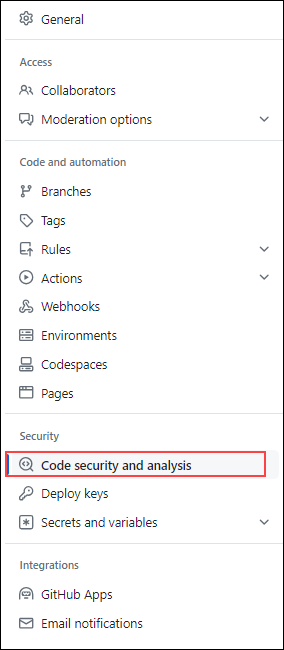
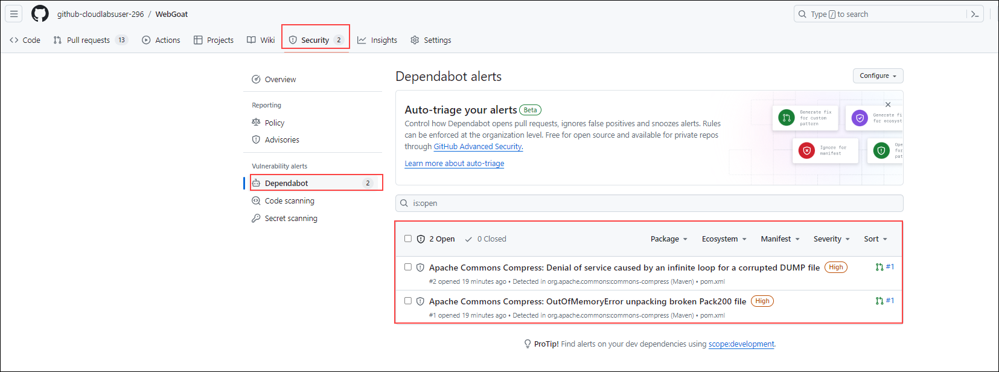
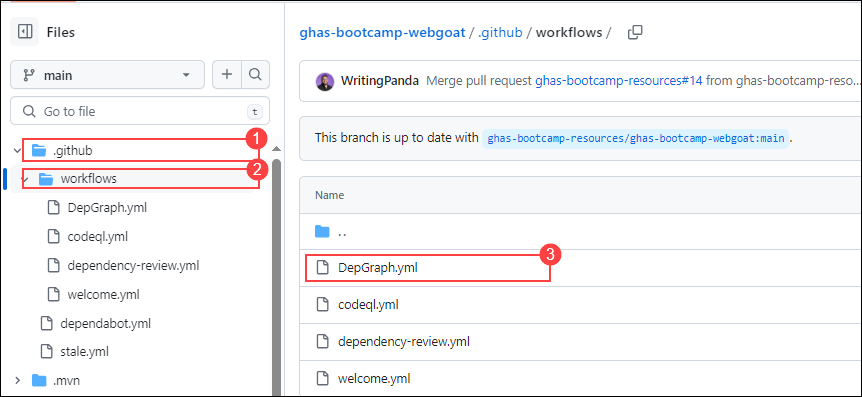
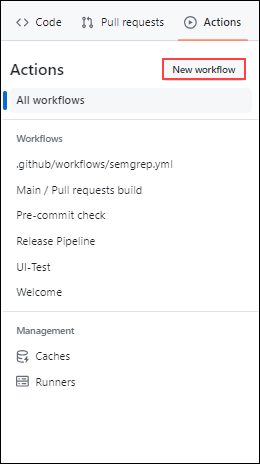
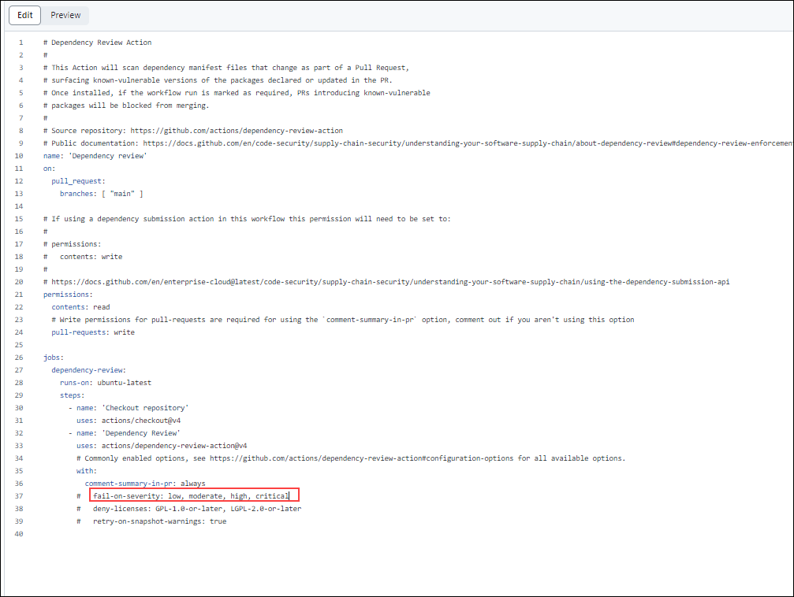
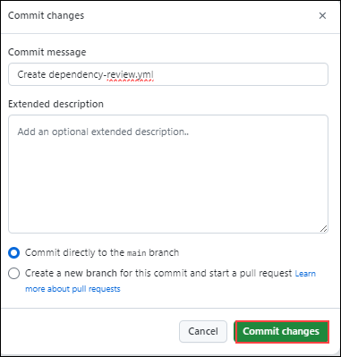
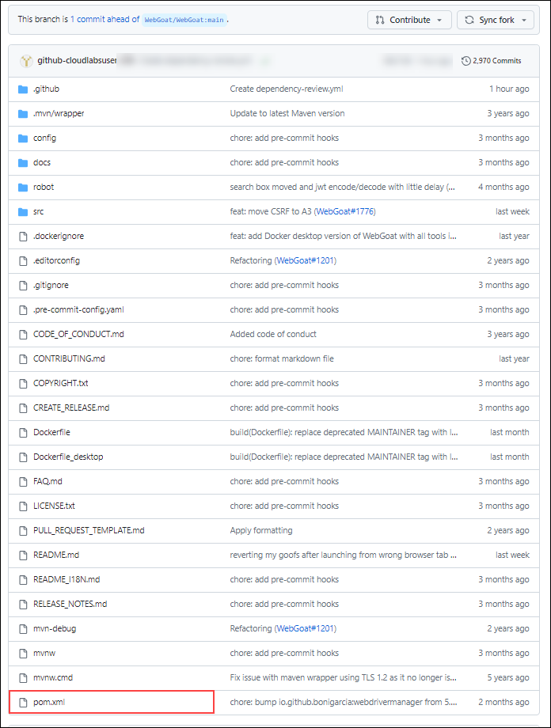

# Module 03: Software Composition Analysis

## Lab Scenario

 In this lab, you will be focusing on improving security within your GitHub repositories using Dependabot and Software Composition Analysis (SCA) features.

## Lab Objectives
In this lab, you will perform:
- Task 1: Turn on dependabot and other SCA features. Review results. 
- Task 2: Use the dependency submission action on a Java project. Review results. 
- Task 3: Use the dependency review action to stop a pull request that contains the log vulnerability. 

### Estimated timing: 40 minutes

## Task 1: Turn on dependabot and other SCA features. Review results. 

1. In the WebGoat repository navigate to **Settings** from the top navigation pane.

   

1. From the left navigation pane, click on **Code Security and Analysis**

   

1. Under **Dependabot** enable **Dependency graph**,**Dependabot Alerts** and **Dependabot security updates**.

   

1. Dependabot raises pull requests to update dependencies. Depending on how your repository is configured, Dependabot may raise pull requests for version updates and/or for security updates. You manage these pull requests in the same way as any other pull request.

1. You can check the Pull requests that are automatically getting triggered through the Depandabot by navigating to the **Security** tab from the top menu and under **Vulnerabilities** click on **Dependabot**.Notice the pull requests that were triggered automatically in the repository.

   

## Task 2: Use the dependency submission action on a Java project. Review results.

GitHub's dependency submission API supports Software Composition Analysis (SCA). It provides a GitHub API that allows uploading a complete list of the dependencies used by a repository (or, more precisely, a particular build of the application in the repository).
The process involves adding all dependencies from a repository to the dependency graph, particularly those resolved during software compilation or building, even if not listed in a manifest file like pom.xml. When new dependency versions are released, Dependabot utilizes data submitted via the dependency submission API to generate pull requests.


1. In the `WebGoat` repository, go to the `.github/workflows/DepGraph.yml` file.

   

1.  This explains how this file will use the **Maven Dependency Tree Submission** action to identify the transitive dependencies.Transitive dependencies are pulled in as part of the build process for this project

1.  Go to the **Actions** section,from the top navigation pane and click on click on the **Dependency Graph Upload** action.

    

1.  Click the **Run workflow** -> **Run workflow**  button

    

1.  Once this is completed, go to the **Dependency Graph** tab, under the **Insights** section

    

1.  This will show the new critical vulnerabilities that have been identified in transitive dependencies.

    


## Task 3: Use the dependency review action to stop a pull request that contains the log vulnerability.
## Dependency Review Action

The dependency review action is a GitHub Action designed for this purpose, preventing vulnerable dependencies from being merged into a repository. This action serves as a proactive measure to maintain the integrity and security of the repository by identifying and mitigating potential risks associated with third-party dependencies.

1. In the WebGoat repo navigate to **Actions** and in the **Actions** click on **New workflow** from the left navigation pane.

    

    
 
 
 1. Now, search **Dependency Review** to find and configure the action by clicking the **Configure** button.
   
    

1. On `Line 8` of the Action workflow configuration there is a [link to the Action's repository](https://github.com/actions/dependency-review-action). Highlight this and open it in a new tab

   

4. Now in this repository, scroll down to the **Configuration options**. We can copy  the example that includes the `fail-on-severity`.

   

5. Paste the example next to the  `fail-on-severity`(line number 37) in the workflow file and click on **Commit Changes** in the right corner.

    

6. Click on **Commit Changes** once again in the pop-up that appears.

   

5. Now back in the **WebGoat** repository go to the **pom.xml** file.

   
   
6. Replace the `WebGoat/pom.xml` file between `Line 154` and `Line 161 with the below code`:
 
      ```xml
        <dependency>
            <groupId>org.apache.logging.log4j</groupId>
            <artifactId>log4j-core</artifactId>
            <version>2.13.1</version>
        </dependency>
     ```

7. Click on **Commit Changes** twice.

8. Now,click on **Pull Request** from the top navigation pane.

   

9. Now, click on **New Pull Request** to create a Pull Request. 

10. Navigate to the **Actions** section and notice the failed **Dependency review** due to the dependency review finding the introduction of a vulnerable `Log4j` version.

    

11. Navigate to **Settings** click on **Branches** under code and automation and review the **Status check** that is required.


## Review

In this module we have completed the following:
 - Turned on dependabot and other SCA features
-  Used the dependency submission action on a Java project.
-  Used the dependency review action to stop a pull request that contains the log vulnerability. 


