# Module 04: Code Scanning

## Lab Scenario

 In this lab, we'll cover a series of tasks designed to provide a comprehensive understanding of code scanning in GitHub. 

## Lab Objectives
In this lab, you will learn and perform:
- Introduction to Code Scanning
- What is CodeQL and how is it different from other static analysis tools? 
- Task 1: Turn on the default setup on a Python repository
- Task 2: Turn on advanced setup on a Java repository
- Task 3: Add some vulnerable code via a pull request and view the scan results in the PR
- Task 4: CodeQL Query Operations in Visual Studio  
- Task 5: Turn on GitHub Advanced Security for Organization

## Estimated timing: 40 minutes

## Architecture Diagram

   
   
## Introduction to Code Scanning 

Code scanning in GitHub is a powerful feature designed to enhance the security of your software projects by automatically identifying and alerting you to potential security vulnerabilities in your codebase. Leveraging advanced static analysis techniques, and code scanning helps detect security flaws, bugs, and other issues early in the development process, enabling developers to address them proactively before they escalate into larger problems. 


## What is CodeQL and how is it different from other static analysis tools?

1. Code Scanning, powered by the CodeQL engine, performs thorough static analysis by accessing source code and integrating with the build process for compiled languages (or simulating compilation for interpreted languages). This approach ensures precise mapping of data flow and the ability to differentiate between remote and local sources. 

1. The fundamental difference is that all of the information about the application is aggregated in a relational database that allows for tracing complete data flows across the entire application.

1. For `compiled` languages, the CodeQL engine running under the hood of the Code Scanning process will hook into the compiler at build time. The CodeQL engine will then listen for the creation of data flows by the compiler, such as linkers and callbacks, and map those data flows as nodes in the database -- aptly called `DataFlow` nodes.
1.  This process allows CodeQL to avoid false positive vulnerability findings from dead code that has no existing dataflows. This is a common problem with other Static Analysis tools that do not have access to the compiler and instead rely on pattern matching and other techniques to identify vulnerabilities.
1. Once the data flow analysis is complete, an extraction of the code is then performed. Every variable, expression (combination or modification of variable(s)), method/function/class declaration, etc. is extracted as individual nodes in the database.

1. CodeQL then performs analysis by querying the database for _Remote_ flow sources that lead to sinks (where data is stored or executed) in ways that are exploitable and are otherwise not sanitized as part of that data flow.

1. For `interpreted` languages, like Javascript and Python, the CodeQL engine performs a depth-first, recursive extraction of the code where `DataFlow` nodes are created from things like `return` statements and passing variables from one function to another. We can gain a comprehensive view of the application and avoid flagging false positive vulnerabilities in code that is never called or executed.

## Task 1: Turn on the default setup on a Python repository

## Default Setup

In this task, you will learn how to activate the default CodeQL setup for a Python repository. This will include enabling CodeQL scanning with the default query suite, which focuses on providing highly accurate and actionable security findings.

1. In the **ghas-bootcamp-xxxx-xx-xx-cloudlabsxxxx** organization, click on repositories from the top navigation pane.

   

1. From the list of repositories click on **ghas-bootcamp-python** to begin working through this module. This repository should have at least 2 code scanning findings with the **Default** and the **Extended** setup in this repository.

   

1. In the GitHub repository navigate to **Settings** from the top navigation pane and click on **Code Security and Analysis** under Security.

   

   >**Note**: Zoom out of the page if you are unable to see the **Settings** option from the top navigation pane.

1. Scroll down and you will find the **Code Scanning** option. Click on the **Setup** button and we have two options to configure code scanning. That is **Default** and **Advanced** as depicted in the screenshot below. For now, click on **Default**

   

1. Leave the query suite on Default and click the **Enable CodeQL** button.

   

1. While that runs (It'll take approx. 5 minutes to get it enabled), let us see the difference between the two query suites.
	  - The Default query suite (also known as the `code-scanning` query suite in the _Advanced_ setup) has a less than 10% False Positive rate from findings within the Open Source ecosystem. We focus very heavily on providing true positive findings that are remotely exploitable, and this suite is the most "dialed in" in terms of findings.
	  - The Extended query suite (also known as the `security-extended` query suite in the _Advanced_ setup) has a less than 30% False Positive rate from findings within the Open Source ecosystem. You will find several interesting queries pulled into this suite, including _Memory Exploitation_ findings for C/C++ and other slightly more niche security vulnerabilities in other languages.

1. After you've clicked the **Enable CodeQL** button, go to the _Actions_ tab to confirm that the initial scan has kicked off. The scan should take a couple of minutes. You can also check more configuration and details inside the the github action run.

   

## Task 2: Turn on advanced setup on a Java repository

In this task, you will learn how to enable and configure the advanced CodeQL setup for a repository. You will gain skills in modifying the codeql.yml file to use the security-extended query suite and understand the benefits of advanced configurations for detecting a broader range of security vulnerabilities. You will also become familiar with the process of validating and reviewing CodeQL actions and results.

## Advanced Setup

 Now, let us enable  Advanced set-up in a different repository.

1. In the **ghas-bootcamp-xxxx-xx-xx-cloudlabsxxxx** organization, click on repositories from the top navigation pane.

   

1. From the list of repositories click on **ghas-bootcamp-java** to begin working through this module. 

   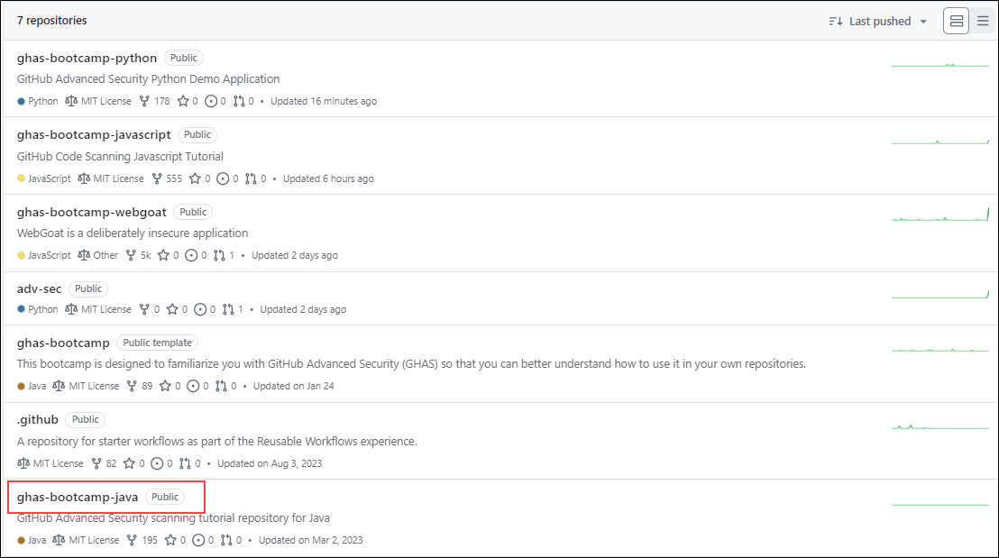

1. Next, we're going to enable Advanced Setup for one of our compiled language repositories by going back to the `ghas-bootcamp-java` repository.

1. In the GitHub repository navigate to **Settings** from the top navigation pane and click on **Code Security and Analysis** under Security.

   

1. Scroll down and you will find the **Code Scanning** option. Click on the **Setup** button and click on **Advanced**

   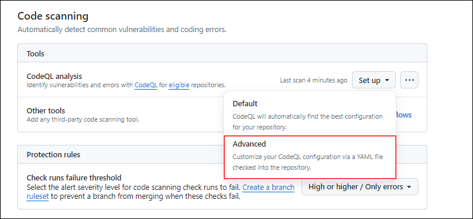

   >**Note:** If it is already enabled, click on **Switch to Advanced**

1. Now you are redirect to the codeql.yml file in github/ workflows directory, and we need to copy the string **queries: security-extended (1)** from the **codeql.yml** file  and append this to a new line at number 66 under **Initialize CodeQL** section , which will read as **queries: security-extended (2)** as shown in the below screenshot. Commit these changes to your **main branch (3)**.

   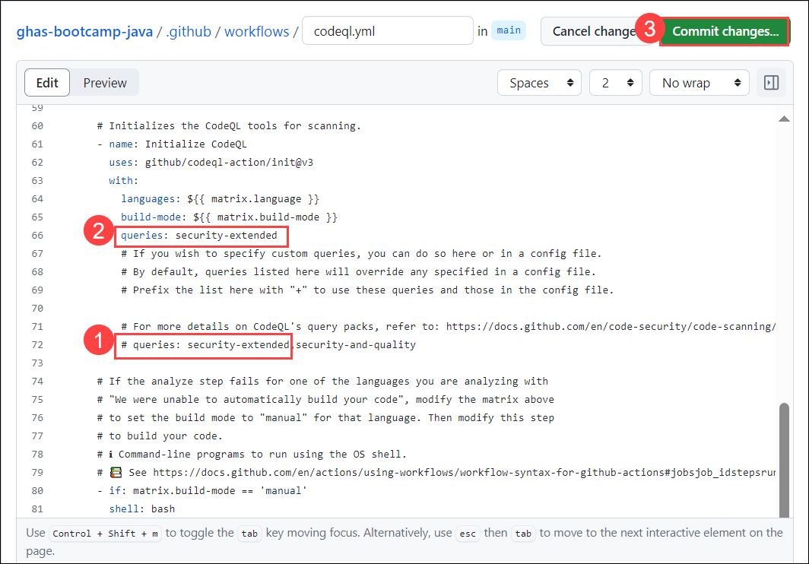

   >**Note:** When updating the `codeql.yml` file, be aware that the line number for the **`Initialize CodeQL`** section may shift slightly, potentially changing from line 66 to one or two lines higher or lower. Ensure you append the string **`queries: security-extended`** to the correct location under this section based on the current line numbers in your file.
  
1. Now,  go to the **Actions** tab to confirm the CodeQL action is running.

   
   
1. You can also review the code and results of that action.

   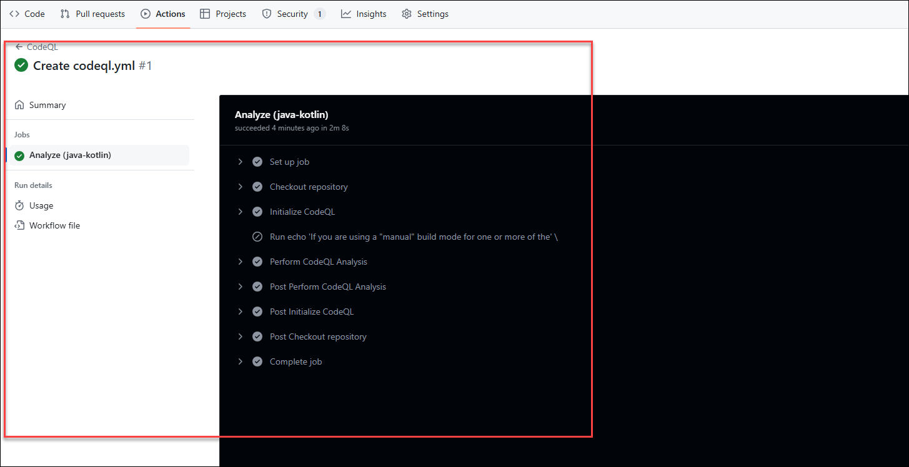

   
   > **Congratulations** on completing the task! Now, it's time to validate it. Here are the steps:
	
   - Hit the Validate button for the corresponding task. If you receive a success message, you can proceed to the next task.
     >**Note:** Upon clicking the **Validate** button for this exercise, you'll receive a prompt to input your Organization name. Provide your **Organization name** which looks like **ghas-bootcamp-xxxx-xx-xx-cloudlabsxxxx**.
    
     >**Note:** Make sure to update the name of your organization, **ghas-bootcamp-xxxx-xx-xx-cloudlabsxxxx**.
    
     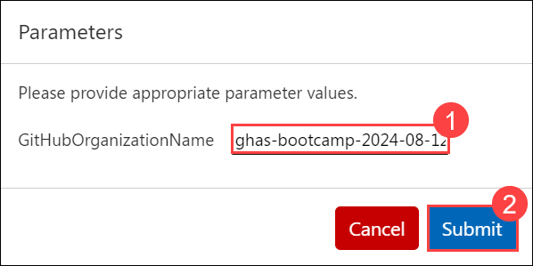
   
   - If not, carefully read the error message and retry the step, following the instructions in the lab guide.
   - If you need any assistance, please contact us at labs-support@spektrasystems.com. We are available 24/7 to help you out.

<validation step="fdc513c6-e817-48a5-aec1-8875b2e7b0a4" />

## Task 3: Add some vulnerable code via a pull request and view the scan results in the PR  

### Task 3.1: Pull Request scans and Accurate Findings

In this task, you will learn how to enhance CodeQL's security analysis by enabling advanced query configurations and integrating extended security queries. You will gain experience in modifying CodeQL workflows, committing changes related to security vulnerabilities in code, and understanding how CodeQL will accurately identify specific issues, such as clear-text logging of sensitive information, while filtering out less relevant findings. This will deepen your understanding of leveraging CodeQL for more precise and effective security scanning in your codebase.

1. Next, we're going to enable _Advanced setup_ for one of our interpreted language repositories by going back to the `ghas-bootcamp-python` repository. Follow the instructions from the **Getting Started** section to go to the `ghas-bootcamp-python` repository.

1. Now, head over to **Settings** -> **Code security and analysis** -> scroll down to **Code scanning** and click the `...` and then click _Switched to advanced_. This will prompt us to turn off the existing CodeQL workflow to avoid duplicating Action runs.Click on **Disable CodeQL**

   

   

1. We are going to make similar updates to the `codeql.yml` file as we did in the `Advanced Setup` section, we need to copy the string **queries: security-extended (1)** from the **codeql.yml** file  and append this to a new line at number 66 under **Initialize CodeQL** section , which will read as **queries: security-extended (2)** as shown in the below screenshot. Commit these changes to your **main branch (3)**.

   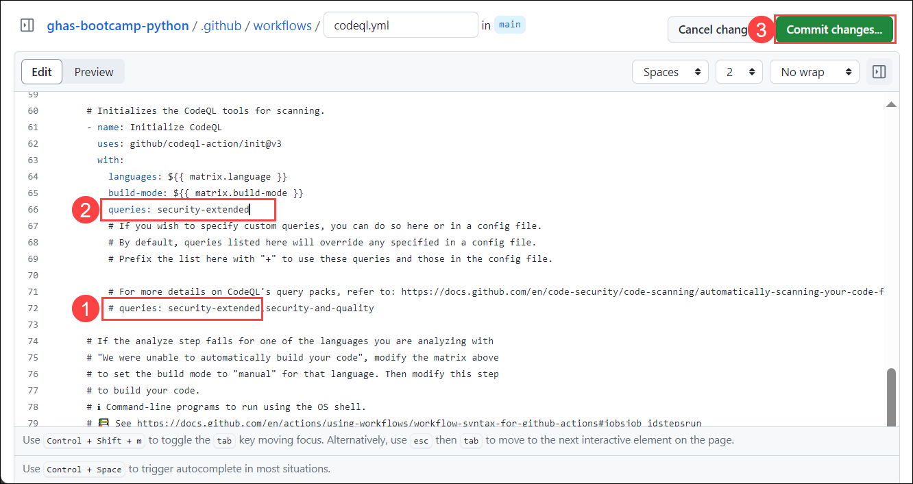

   >**Note:** When updating the `codeql.yml` file, be aware that the line number for the `Initialize CodeQL` section may shift slightly, potentially changing from line 66 to one or two lines higher or lower. Ensure you append the string `queries: security-extended` to the correct location under this section based on the current line numbers in your file.

1. In the Code tab of the Python repository, navigate to the server folder to open the `routes.py` file and scroll down to **Line 40**.

   
 
  
1. Notice that this part of the code is related to the vulnerabilities that have to do with SQL.

1. Add the some spaces at the bottom of the file and make sure to **commit the changes**.

   

1. Click on commit to commit these changes to a new branch,  click on **Create pull request**, open a **Pull request** into the **main** branch, and click on **Create pull request** again.
 
   

   
     
1. Because our main branch isn't a `Protected Branch`, it may take a moment for the Action to trigger and the **Merge pull request** button will display green until the Action kicks off.
   
   - CodeQL does not flag this pull request with a _Query built from user-controlled sources_ finding.

   

## Task 4: CodeQL Query Operations in Visual Studio Code

In this task, you will set up and use CodeQL in Visual Studio Code to analyze a Python codebase. The steps involve installing necessary extensions, cloning a repository, and running a CodeQL query to identify named entities within the code.

1. Start **Visual Studio Code** from the desktop.

    

1. In the Visual Studio Code, Click on **Extensions**, search and select the **CodeQL**, click on **install**.

    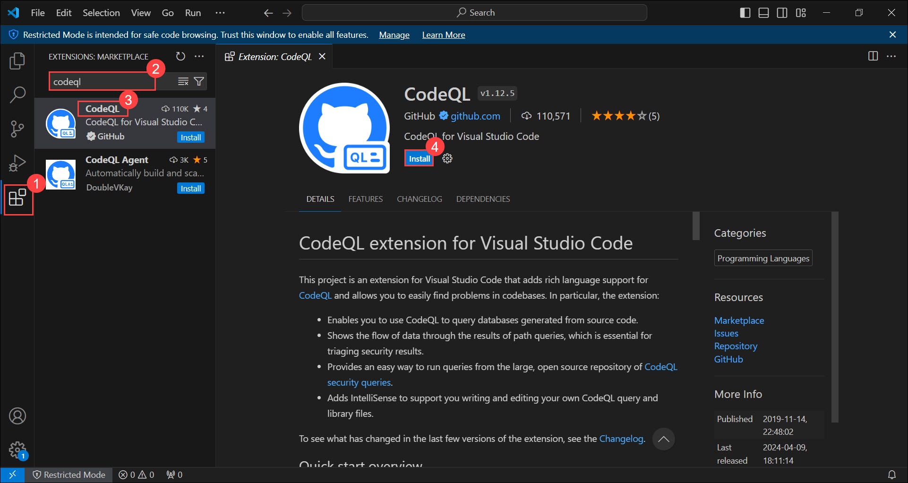

1. In the Visual Studio Code terminal, click on **(...)** (1) and select the **Terminal** (2) menu, select **New Terminal** (3). The terminal window usually opens in the lower half of your screen.

    

1. Change the location to **Desktop** for easy navigation.

    ```
    cd Desktop
    ```
    
1. Clone the repository by running the following command, You can also obtain the URL of your repository by navigating to it, clicking on the **Code** tab, and copying the URL provided.

    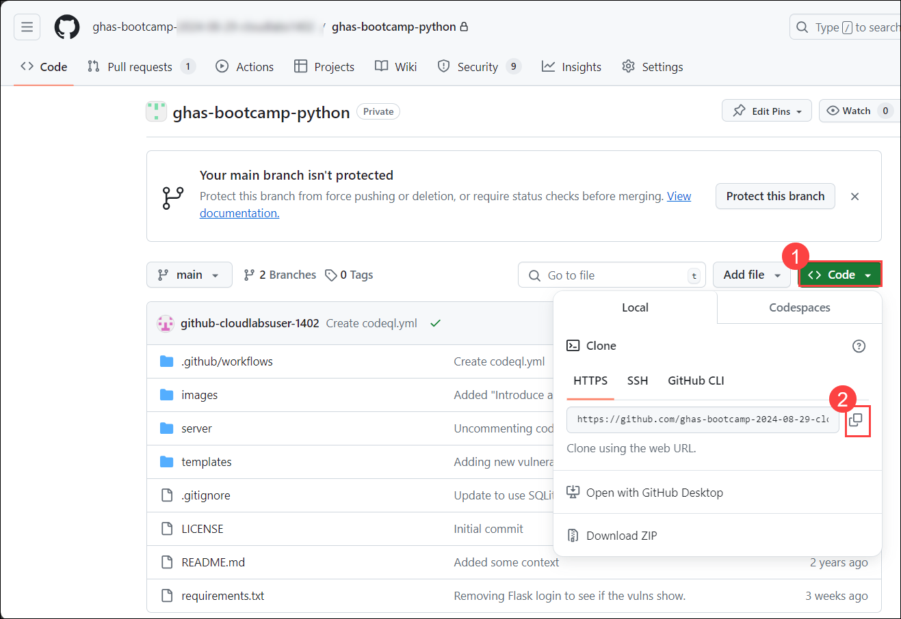

      >**Note**: Make sure to update the name of your organization, **ghas-bootcamp-xxxx-xx-xx-cloudlabsxxxx**.

      ```
      git clone --recursive https://github.com/ghas-bootcamp-xxxx-xx-xx-cloudlabsxxxx/ghas-bootcamp-python.git
      ```

    

    >**Note**: If a pop up appears to login, click on Login from borwser and Sign in with GitHub Credentials and on the Authorize GitHub for VS Code page click on the Authorize Visual-Studio-Code.

1. Go to the **Explorer** in the upper left corner, select **Open Folder**, select the folder you cloned from the **Desktop**, and then click **Select Folder**.

    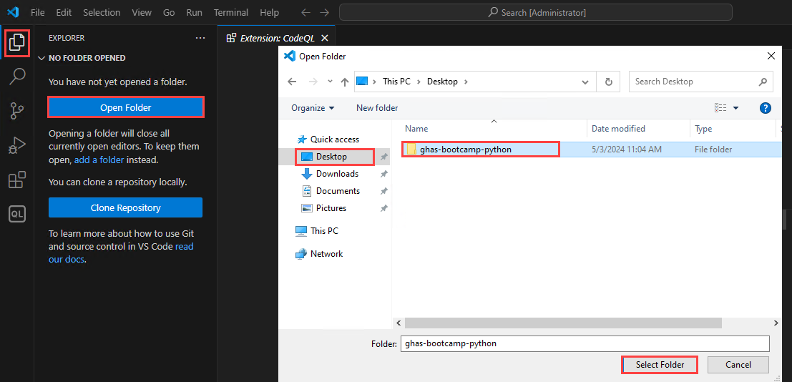

1. Select **Yes, I trust the authors**.

    

1. If you receive a pop-up requesting permission to collect usage data, simply click **Yes** to proceed.

    

1. Go to **Account** icon from bottom and click on **Sign in with GitHub to use CodeQL**. Please note it might take some time to get the extension updated with code, If you get any pop-up select yes. 

    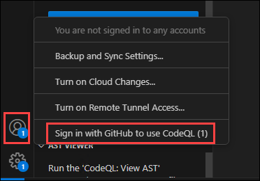

    >**Note:** If you encounter a pop-up requesting you to sign in with GitHub credentials or authorize GitHub for VS Code, click on **Authorize Visual Studio Code** to proceed.

1. If you get the pop-up, The site is trying to open the Visual Studio Code then click on **Open**. It will navigate back to the Visual Studio.

    

1. Go to the **CodeQL** extension and move the cursor over the **Database**, click on the **GitHub** icon.

      

1. Add the Database by the following command and press enter.

    >**Note**: Make sure to update the name of your organization, **ghas-bootcamp-xxxx-xx-xx-cloudlabsxxxx**.

    ```
    https://github.com/ghas-bootcamp-xxxx-xx-xx-cloudlabsxxxx/ghas-bootcamp-python
    ```

    

1. Go to the **Queries** section, click on **Create query** option and select **Python** as your target query language.

    

1. It will show up the location for query, press **enter**.

    

1. It will generate the simple query, click on the **Run**  from right corner (1) and analyze the result.

    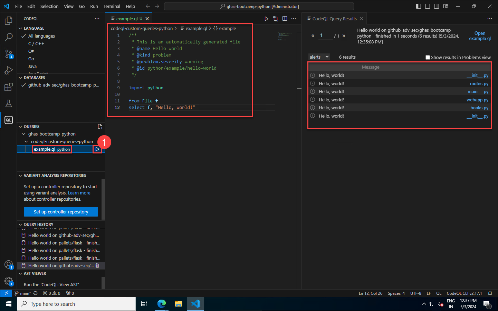

    >**Note**: If you receive a pop-up asking to run queries: example.ql , simply click **Yes** to proceed.

1. Now, replace the existing code with the provided code snippet. Then, click on the **Run** button to execute it.

   - This CodeQL query identifies named entities (special functions, built-in functions, modules, and files) in a Python codebase from a specified list of names ("foo", "baz", "main", "os", "sys", "re"). It checks if each name matches a specific type ("special", "builtin", "module", "file") and selects them, ordering the results by name and kind. 

	  ```
	  import python
	  import semmle.python.types.Builtins
	
	  predicate named_entity(string name, string kind) {
	   exists(Builtin::special(name)) and kind = "special"
	    or
	    exists(Builtin::builtin(name)) and kind = "builtin"
	    or
	    exists(Module m | m.getName() = name) and kind = "module"
	    or
	    exists(File f | f.getShortName() = name + ".py") and kind = "file"
	  }
	
	  from string name, string kind
	  where
	    name in ["foo", "baz", "main", "os", "sys", "re"] and
	    named_entity(name, kind)
	  select name, kind order by name, kind
	  ```

    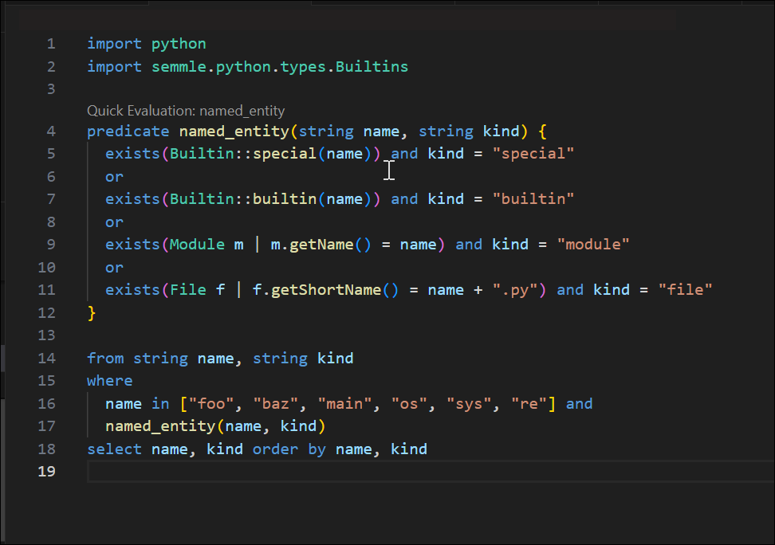

17. This results helps to understand the classification and usage of these entities in the code.

    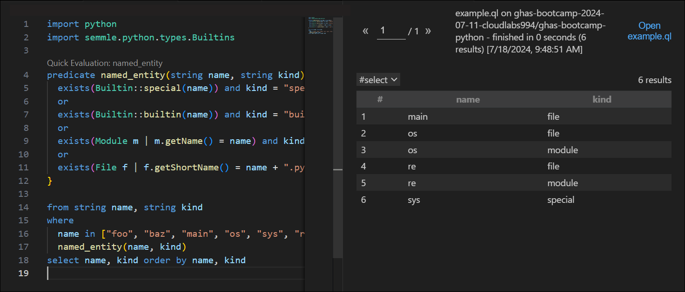

Please feel free to go through the document for further understanding:[Code Security](https://docs.github.com/en/code-security) and [CodeQL Documentation](https://codeql.github.com/docs/)

### Task 5: Turn on GitHub Advanced Security for Organization. [Read Only]

#### About the GitHub-recommended security configuration

The GitHub-recommended security configuration is a collection of enablement settings for GitHub's security features that is created and maintained by subject matter experts at GitHub. The GitHub-recommended security configuration is designed to successfully reduce the security risks for low- and high-impact repositories. We recommend you apply this configuration to all the repositories in your organization.

   Refer to the link for more information. [About the GitHub-recommended security configuration](https://docs.github.com/en/enterprise-cloud@latest/code-security/securing-your-organization/enabling-security-features-in-your-organization/applying-the-github-recommended-security-configuration-in-your-organization)

In this task, you will configure and apply security settings across all repositories within an organization. 
 
1. On the **Home** page, click on your **profile** icon in the top right corner.

   

2. Select **Your organizations** from the dropdown menu.

   

3. Choose **ghas-bootcamp-xxxx-xx-xx-cloudlabsxxx** from the list of organizations.

   

4. Navigate to the repository and click on the **Settings** tab.

   

5. In the Settings menu, click-on **Configurations** under Code Security under Security section.

   

6. Click on **Apply to** and select **All repositories** to apply the configuration.

   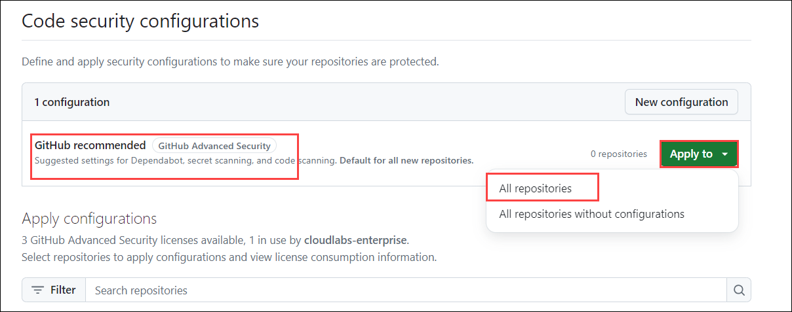

7. Click on **Apply** to confirm the configuration changes, when the prompt appears.

   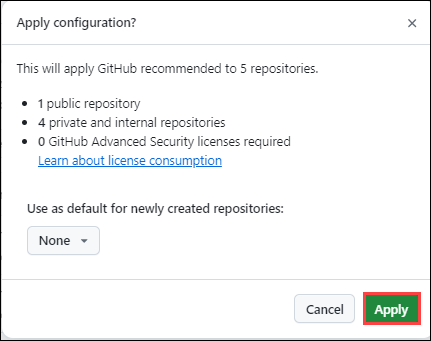

## Review

In this lab you have completed the following:

- Learned how CodeQL is different from other static analysis tools
- Turned on the default setup on a Python repository 
- Turned on the advanced setup on a Java repository
- Added some vulnerable code via a pull request and viewed the scan results in the PR. 
- Demonstrated CodeQL Query Operations in Visual Studio Code
- Turned on GitHub Advanced Security for Organization 
