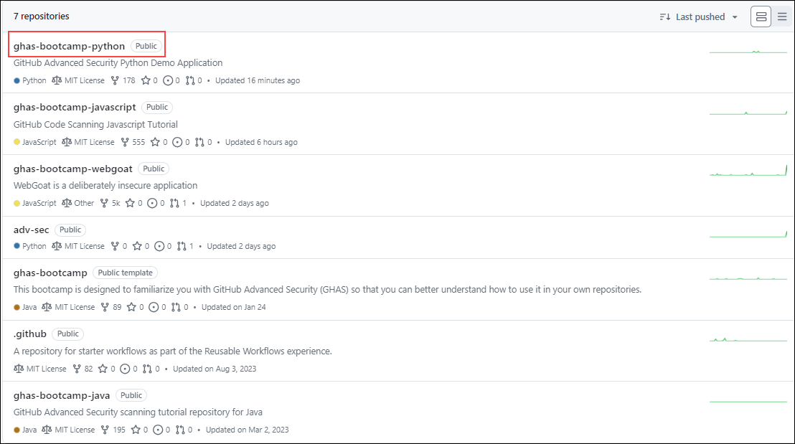
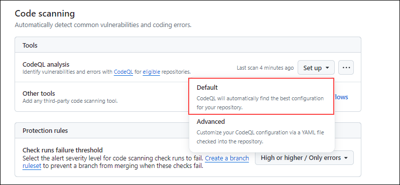
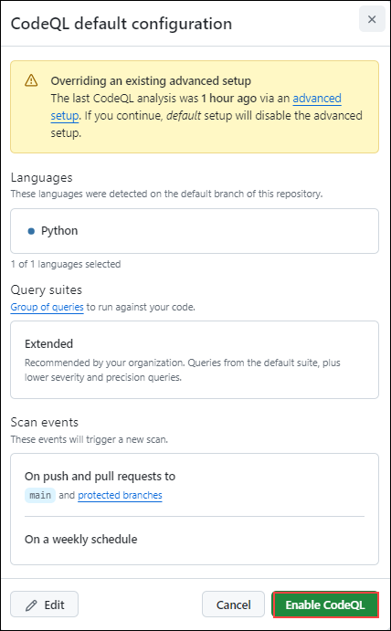
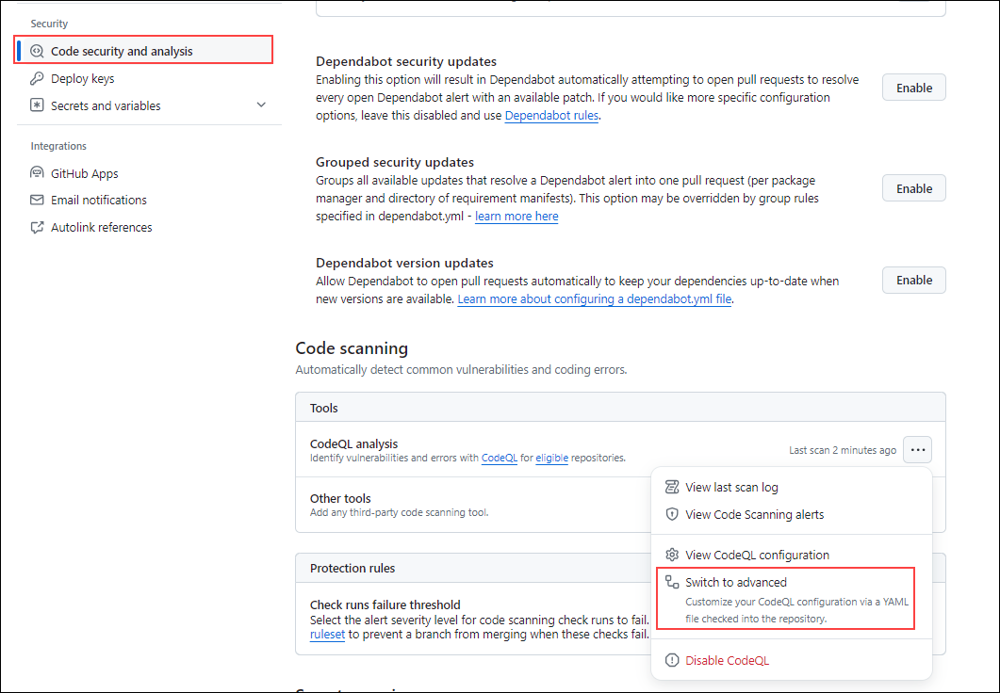
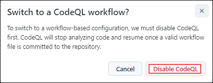
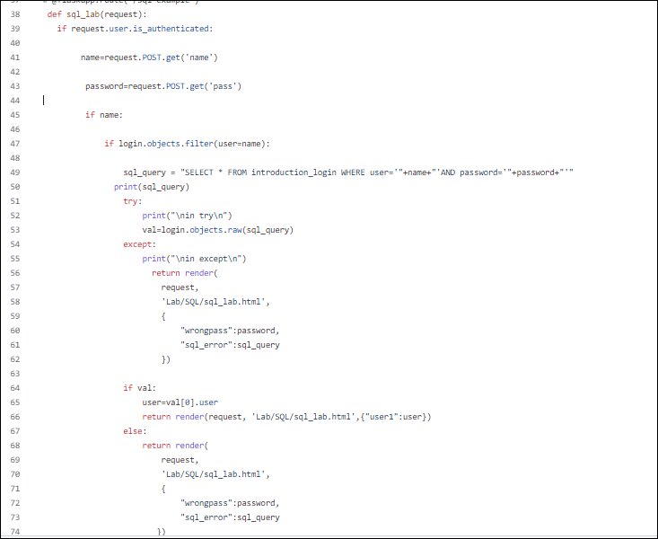
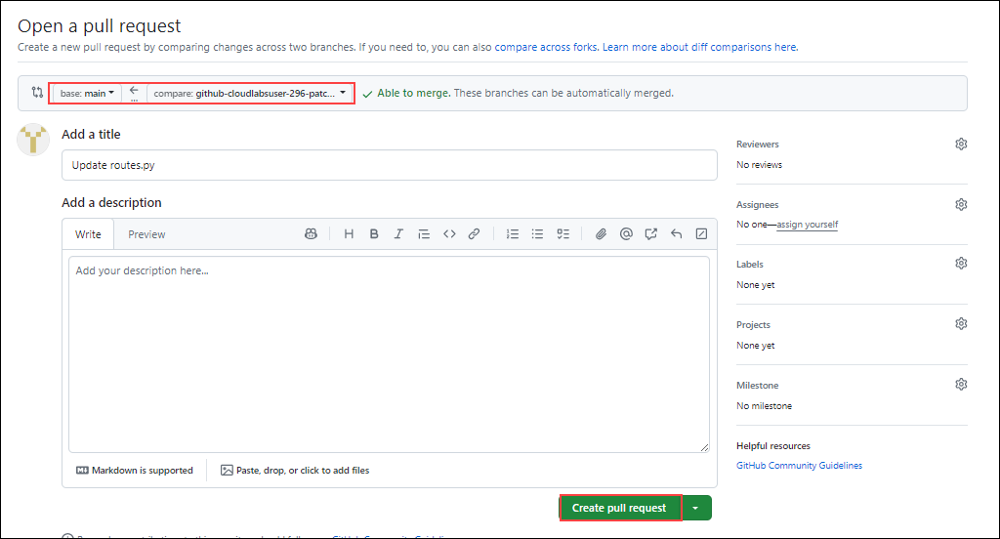

# Module 04: Code Scanning

## Lab Scenario

 In this lab, we'll cover a series of tasks designed to provide a comprehensive understanding of code scanning in GitHub. 

## Lab Objectives
In this lab, you will perform:
- Task 1: Introduction to Code Scanning
- Task 2: What is CodeQL and how is it different from other static analysis tools? 
- Task 3: Turn on default setup on a Python repository. View results. 
- Task 4: Turn on advanced setup on a Java repository. Customize the scan. View results. 
- Task 5: Add some vulnerable code via a pull request and view the scan results in the PR.  

## Estimated timing: 40 minutes

## Architecture Diagram

   
   
## Task 1: Introduction to Code Scanning 

Code scanning in GitHub is a powerful feature designed to enhance the security of your software projects by automatically identifying and alerting you to potential security vulnerabilities in your codebase. Leveraging advanced static analysis techniques, code scanning helps detect security flaws, bugs, and other issues early in the development process, enabling developers to address them proactively before they escalate into larger problems. 

## Task 2: What is CodeQL and how is it different from other static analysis tools?

1. Code Scanning, powered by the CodeQL engine, performs thorough static analysis by accessing source code and integrating with the build process for compiled languages (or simulating compilation for interpreted languages). This approach ensures precise mapping of data flow and the ability to differentiate between remote and local sources. 

1. The fundamental difference is that all of the information about the application is aggregated in a relational database that allows for tracing complete data flows across the entire application.

1. For `compiled` languages, the CodeQL engine running under the hood of the Code Scanning process will hook into the compiler at build time. The CodeQL engine will then listen for the creation of data flows by the compiler, such as linkers and callbacks, and map those data flows as nodes in the database -- aptly called `DataFlow` nodes.
1.  This process allows CodeQL to avoid false positive vulnerability findings from dead code that has no existing dataflows. This is a common problem with other Static Analysis tools that do not have access to the compiler and instead rely on pattern matching and other techniques to identify vulnerabilities.
1. Once the data flow analysis is complete, an extraction of the code is then performed. Every variable, expression (combination or modification of variable(s)), method/function/class declaration, etc. is extracted as individual nodes in the database.

1. CodeQL then performs analysis by querying the database for _Remote_ flow sources that lead to sinks (where data is stored or executed) in ways that are exploitable and are otherwise not sanitized as part of that data flow.

1. For `interpreted` languages, like Javascript and Python, the CodeQL engine performs a depth-first, recursive extraction of the code where `DataFlow` nodes are created from things like `return` statements and passing variables from one function to another. We can gain a comprehensive view of the application and avoid flagging false positive vulnerabilities in code that is never called or executed.

## Task 3: Turn on default setup on a Python repository. View results. 

## Default Setup

1. In the **github-adv-sec** organization, click on repositories from the top navigation pane.

   

1. From the list of repositories click on **ghas-bootcamp-python** to begin working through this module. This repository should have at-least 2 code scanning findings with the **Default** and the **Extended** setup in this repository.

   

1. In the GitHub repository navigate to **Settings** from the top navigation pane and click on **Code Security and Analysis** under Security.

   

1. Scroll down and you will find the **Code Scanning** option. Click on the **Setup** button and we have two options to configure code scanning. That is **Default** and **Advanced** as depicted in the screenshot below.For now,click on **Default**

   

1. Leave the query suite on Default and click the **Enable CodeQL** button.

   

1. While that runs, let us see the difference between the two query suites.
  - The Default query suite (also known as the `code-scanning` query suite in the _Advanced_ setup) has a less than 10% False Positive rate from findings within the Open Source ecosystem. We focus very heavily on providing true positive findings that are remotely exploitable, and this suite is the most "dialed in" in terms of findings.
  - The Extended query suite (also known as the `security-extended` query suite in the _Advanced_ setup) has a less than 30% False Positive rate from findings within the Open Source ecosystem. You will find a number of interesting queries get pulled into this suite, including _Memory Exploitation_ findings for C/C++ and other slightly more niche security vulnerabilities in other languages.

1. After you've clicked the **Enable CodeQL** button, go to the _Actions_ tab to confirm that the initial scan has kicked off. The scan should take a couple of minutes.

   

## Task 4: Turn on advanced setup on a Java repository. Customize the scan. View results. 

## Advanced Setup

 Now, let us enable  Advanced set-up in a different repository.

1. In the **github-adv-sec** click on repositories from the top navigation pane.

   

1. From the list of repositories click on **ghas-bootcamp-java** to begin working through this module. 

   

1. Next, we're going to enable Advanced Setup for one of our compiled language repositories by going back to the `ghas-bootcamp-java` repository.

1. In the GitHub repository navigate to **Settings** from the top navigation pane and click on **Code Security and Analysis** under Security.

   

1. Scroll down and you will find the **Code Scanning** option. Click on the **Setup** button and click on **Advanced**

   

   >**Note:** If it is already enabled, click on **Switch to Advanced**

1. In the **codeql.yml** file, we are going to copy **Line 69** of the workflow file `# queries: security-extended` (1) and append this to a new line we create for **Line 64** which will read `queries: security-extended`(2).Commit these changes to your main branch(3)

   
  
1. Now,  go to the **Actions** tab to confirm the CodeQL action is running.

   

## Task 5: Add some vulnerable code via a pull request and view the scan results in the PR.  

## Pull Request scans and Accurate Findings

1. Next, we're going to enable _Advanced setup_ for one of our interpreted language repositories by going back to the `ghas-bootcamp-python` repository.Follow the instructions from the **Getting Started** section in order to go to the `ghas-bootcamp-python` repository.

1. Now, head over to **Settings** -> **Code security and analysis** -> scroll down to **Code scanning** and click the `...` and then click _Switched to advanced_. This will prompt us to turn-off the existing CodeQL workflow in order to avoid duplicating Actions runs.Click on **Disable CodeQL**

   

   

1. We are going to make similar updates to the `codeql.yml` file as we did in the `Advanced Setup` section by copying **Line 69** of the workflow file `# queries: security-extended` (1) and append this to a new line we create for **Line 64** which will read `queries: security-extended` (2). Commit these changes to your main branch (3).

   

1. In the Code tab of the Python repository, navigate to the server folder to open `routes.py` file  and scroll down to **Line 40**.

   
 
  
1. Notice that this part of the code is related to the  vulnerabilities that  has to do with SQL.

1. Uncomment the Python code starting from **line 38** until the end of the code. 

   

1. Click on commit to commit these changes to a new branch,  click on **Create pull request**and open a **Pull request** into the **main** branch and click on **Create pull request** again.
 
   

   
     
1. Because our main branch isn't a `Protected Branch`, it may take a moment for the Action to trigger and the **Merge pull request** button will display green until the Action kicks-off.

1. CodeQL does not flag this pull request with a _Query built from user-controlled sources_ finding. But why?

1. Go to the **Files changed** tab and review the code we added.
  - What we find on **Line 54** is a `val` assignment calling to `login.objects.raw` - which does not exist as a function in this project.
    - While other Static Analysis tools would likely have marked **Line 50** as a SQL Injection, the CodeQL analysis performed as part of Code Scanning correctly marks this as `Clear-text logging of sensitive information` finding. This is the power of CodeQL in action - accurately tracing dataflows and identifying security vulnerabilities in your code without all of the noise.

## Review

In this lab you have completed the following:

- Learnt how CodeQL is different from other static analysis tools
- Turned on the default setup on a Python repository 
- Turned on the advanced setup on a Java repository
- Added some vulnerable code via a pull request and viewed the scan results in the PR.  
