# Module 05: Scaling out GitHub Advanced Security

## Lab Scenario

## Lab objectives
In this lab, you will perform:

- Task 1: How to grow adoption? How to communicate about GHAS internally?  
- Task 2: View the security overview dashboard and reports 
- Task 3: Review webhooks and how they can be used to push events to an outside reporting tool, like a SIEM 
- Task 4: Talk about repository rulesets and how they can be used at scale 

### Estimated timing:  minutes

## Task 1: How to grow adoption? How to communicate about GHAS internally? [ Read Only ]

Adopting GitHub Advanced Security can be approached in multiple ways and requires a strategic approach for success, especially in larger enterprises and organisations with thousands of repositories. The purpose of this to lay down a foundation for enterprises on how to adopt GHAS, but most importantly, scale it quickly and efficiently.Enabling GitHub Advanced Security across a large organisation can be broken down into **six** core phases:

1. **Align on your rollout strategy and goals**: Think about what success will look like, and align on how GHAS will be implemented in your company. This phase may only take a few days or a week, but it lays a solid foundation for the rest of the rollout.

1. **Preparing to enable at scale:** Prepare developers, collect data about your repositories, and ensure you're ready for the next phase.

1. **Pilot programs:** Optionally, pilot an initial rollout to a few high-impact projects and teams. This will allow an initial group within your company to get familiar with GHAS before you roll out to the remainder of your company.

1. **Create internal documentation:** Create and communicate internal documentation for the consumers of GHAS. Without proper documentation provided to developers, security engineers, and others who will be using GHAS, the value will get lost in the rollout.

1. **Rollout and scale code scanning:** Leveraging the available APIs, automatically rollout code scanning by team and by language across your enterprise, using the repository data you collected earlier.

1. **Rollout and scale secret scanning:** Roll out secret scanning, which involves less configuration and is therefore simpler to adopt than code scanning. Still, it's critical to have a strategy for handling new and old results.
   
**Phase One - Strategic Enablement Alignment**

Although it's appealing to rush into the implementation phase, take the time to align on how GHAS will be implemented in your enterprise. Additionally, think about what success could look like in the 3,6 and 9 months after adoption. This phase may only take a few days or a week, but it lays a solid foundation for the rest of the rollout.

**Phase Two - Create Internal Documentation**

Like the above phase, organisations tend to rush into the implementation phase, as that stage is perceived to provide the quickest time-to-value. However, without the proper documentation and asynchronous resources provided to aid developers, security engineers, etc., in consuming GHAS correctly, usually, the value gets lost in the rollout due to people not consuming GHAS in the correct way. Take the time to create internal documentation (such as training, how to remediate, where to go for questions, etc.), and then communicate this documentation (email, teams, slack, etc.) to the consumers of GHAS so once you rollout GHAS, teams and people know what to do.

**Phase Three - Enable & Scale Code Scanning**

GHAS is an ecosystem of multiple solutions; it's essential to start somewhere focused, not just with the rollout of GHAS. Typically, we see teams focus on code scanning, to begin with. Leverage the API's available and rollout code scanning by team and by language across your organisation automatically. This allows you to scale in an automated fashion and removes a lot of manual repeatable groundwork for developers and consumers of code scanning. Doing this will increase adoption.

### Task 2: View the security overview dashboard and reports 

In this task, you will explore the security overview dashboard and reports provided by GHAS to gain insights into your repository's security posture.

1. Go to your profile icon in the  top right corner, and then select **Your organizations**.

    
     
1. Select **github-adv-sec** from organizations.

    

1. Navigate to the **security** tab of your GitHub repository.

   

1. Explore the security overview dashboard, Use the options at the top of the overview page to filter the group of alerts you want to see metrics for. All of the data and metrics on the page will change as you adjust the filters.

   
   
1. For the alert trends graph at the top of the page, you can click  Open alerts or  Closed alerts to toggle between showing the trends for open or closed alerts. The toggle will only affect the alert trends graph.

   
   
1. Analyze the metrics and data provided in the reports to identify areas of improvement and prioritize security efforts.


### Task 3: Review webhooks and how they can be used to push events to an outside reporting tool, like a SIEM 

GitHub webhooks are a mechanism for automatically triggering actions or notifications in external systems when events occur within a GitHub repository. Users can configure webhooks to listen for specific events, such as pushes to a repository, pull request creation or closure, issue creation or comment, etc. When the specified event occurs, GitHub sends an HTTP POST payload to a designated URL, known as the payload URL, containing information about the event. This allows users to integrate GitHub with external services, such as CI/CD pipelines, issue trackers, or chat platforms, enabling automated workflows and real-time notifications based on repository activities.

#### Task 3.1: Installing necessary tools.

1. Search for **powershell** in windows search, select **Powershell ISE** and **Run as administrator**.

    
   
1. Paste the following commands to install ***nodejs (1)*** and click on **Run (2)** button.

     ```
    #Install nodejs v16.8.0
    $WebClient = New-Object System.Net.WebClient
    $WebClient.DownloadFile("https://nodejs.org/download/release/v16.8.0/node-v16.8.0-x64.msi","C:\node-v16.8.0-x64.msi")
    $arguments = "/i `"C:\node-v16.8.0-x64.msi`" /quiet"
    Start-Process msiexec.exe -ArgumentList $arguments -Wait
    sleep 5
      ```

    

1. To install **Scoop** copy the following command and paste it in the powershell editor, highlight the code and click **Run**.

      ```
      iex "& {$(irm get.scoop.sh)} -RunAsAdmin"
      ```

     

1. To install **git** copy the following command and paste it in the powershell editor, highlight the code and click **Run**

      ```
      $WebClient = New-Object System.Net.WebClient
      $WebClient.DownloadFile("https://github.com/git-for-windows/git/releases/download/v2.44.0.windows.1/Git-2.44.0-64-bit.exe","C:\Git-2.44.0-64-bit.exe")
      $arguments = "/VERYSILENT /NORESTART /NOCANCEL /SP-"
      Start-Process "C:\Git-2.44.0-64-bit.exe" -ArgumentList $arguments -Wait
      sleep 5
      ```

      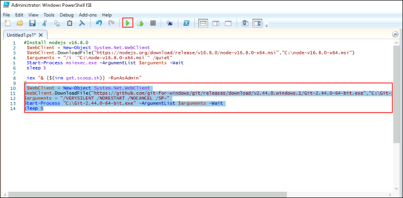

#### Task 3.2: Clone a demo API server for receiving GitHub webhooks

1. Start **Visual Studio Code** from the desktop.

    

1. In the Visual Studio Code terminal, click on **(...)** (1) and select the **Terminal** (2) menu, select **New Terminal** (3). The terminal window usually opens in the lower half of your screen.

    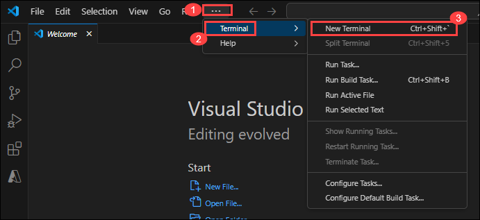
    
1. Clone the repository by running the following command:

      ```
      git clone --single-branch --branch github-webhooks https://github.com/hookdeck/nodejs-webhook-server-example.git
      ```

1. Navigate to the root of the project and install the required dependencies by running the following commands:

      ```
      cd nodejs-webhook-server-example
      ```

      ```
      npm install
      ```
      ```
      npm start
      ```
      
    
   
   >**Note:** This will boot up the API application and print a message to the screen indicating that the API is now running and listening for connections on port 1337.
   
#### Task 3.3: Get the webhook URL

1. Install the hookdeck by running the following commands.

      ```
      scoop bucket add hookdeck https://github.com/hookdeck/scoop-hookdeck-cli.git
      ```
      ```
      scoop install hookdeck
      ```

1. To allow traffic on port 1337

      ```
      netsh interface portproxy add v4tov4 listenport=1337 listenaddress=0.0.0.0 connectport=1337 connectaddress=127.0.0.1
      ```

1. To verify that the port is listening, you can use the following command:

      ```
      netstat -an | find "1337"
      ```
      
1. Once the setup process is complete, the next step is to use the CLI to generate a webhook URL that points to the running API application.

      ```
      hookdeck listen 1337
      ```

1. This command starts an interactive session where the CLI collects information about the endpoint you're about to create. Below are the questions and the answers you should supply to each question.

    | Question | Answer |
    | -- | -- |
    | **What source should you select?** | select **Create new source** |
    | **What should your new source label be?** | type the text **Github** |
    | **What path should the webhooks be forwarded to (i.e.: /webhooks)?** | type **/log-github-webhook** |
    | **What's the connection label (i.e.: My API)?** | type **My Github Response Server** |

1. With this information, the CLI will begin the process of generating the URL and once it's done, you will see the URL printed to the screen and the CLI indicating that it is ready to receive requests.

    

1. Now copy and paste **Inspect and replay webhooks** URL into your browser, and copy the URL.

    

1. Copy the URL

    
   
1. Navigate to your repository's, click  Settings.

   

1. Click on **webhook**.

   

1. Click on **Add Webhooks**. and give your github password.

1. On the webhook form displayed, paste the webhook URL generated by the Hookdeck CLI into the **Payload URL (1)** field.

- **Content type**: Select **application/json (2)** so that you can receive the payload as a JSON object.
- **Secret**: You can leave this blank.
- **SSL verification**: Leave this as the default option of **Enable SSL verification (3)**.
- **Which events would you like to trigger this webhook?**: select the **Just the push event option (4)**.
- **Active (5)**: Leave this checked to receive event details when the GitHub webhook is triggered.
- Click on **Add Webhooks (6)**.
      
   

13. On the console page in web it will give the **Accepted** Status of your webhooks.

    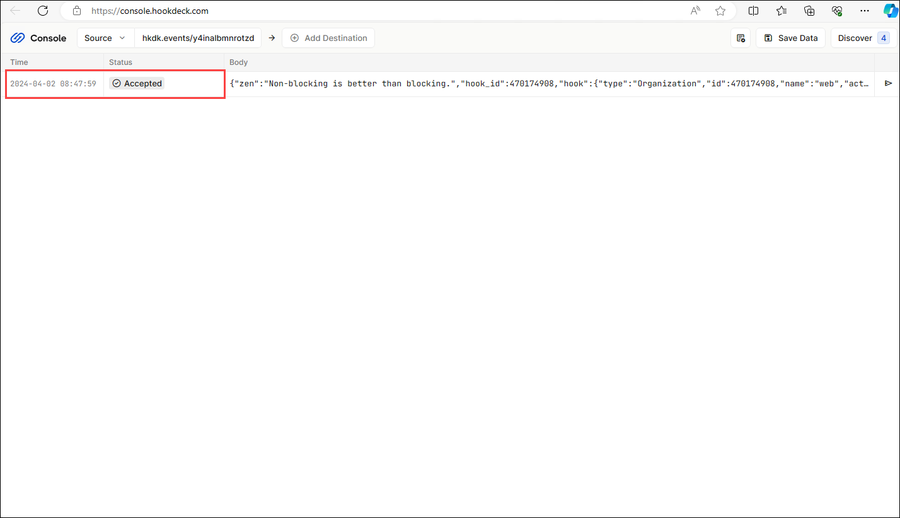

    >**Note**: It will take 3-5 minutes to show the status.

#### Task 3.4: Push events to an outside reporting to Function App.

1. Navigate to the Azure Portal search for **Function app (1)** in search bar, select **Function App (2)**.

   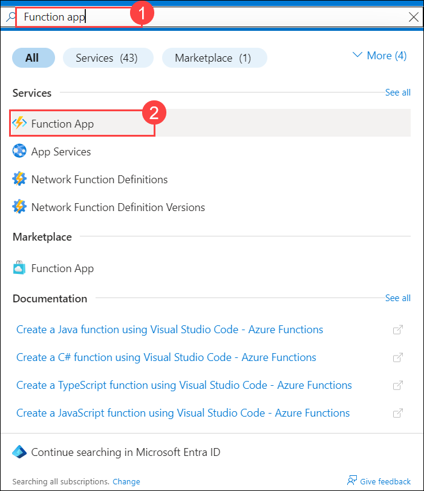

1. Click on create.

1. On Basics of Create Function App, provide details for your label. Select **Review + create** at the bottom of the page.

    | Setting | Action |
    | -- | -- |
    | **Subscription** | select your subscription |
    | **Resource Group** | Select your resource group |
    | **Function App name** | **function-webhooks** |
    | **Do you want to deploy code or container image?** | **Code** |
    | **Operating System** | **Windows** |
    | **Hosting options and plans** | **Consumption (Serverless)** |

   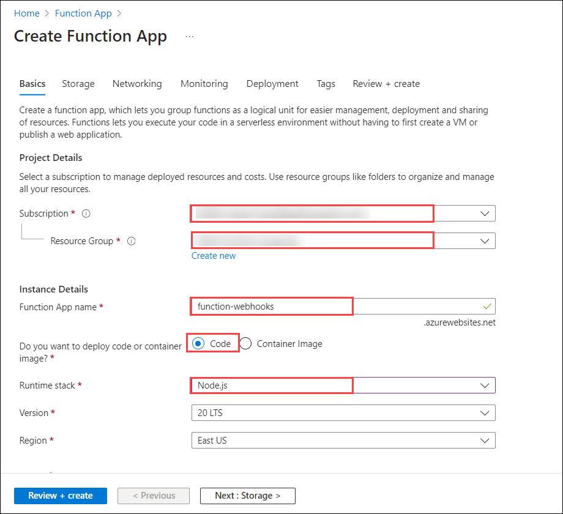
   
   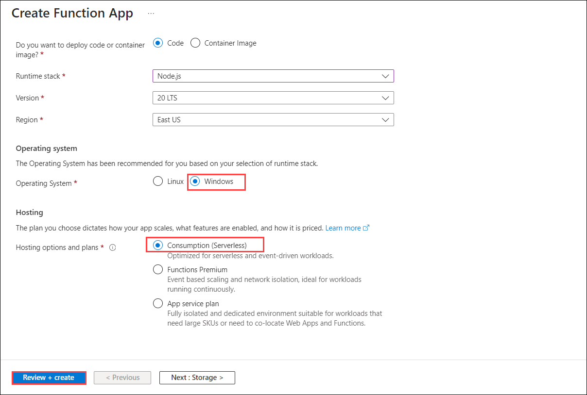
   
1. Once the deployment is completed, click on **Go to resource**.

1. On **Overview** page of function app, Under the section of **Function** click on **Create function**, it will open a page from them select **Deployment environment** as **Deploy in portal** and select the **HTTP trigger**, click to **Create**.

   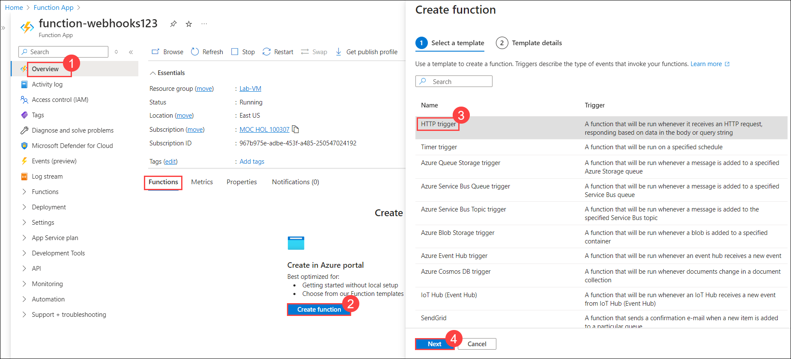

1. On your **HttpTrigger** function, Click on the **Code + Test** under the **Developers** section and click on **Get Function URL** for copy.

   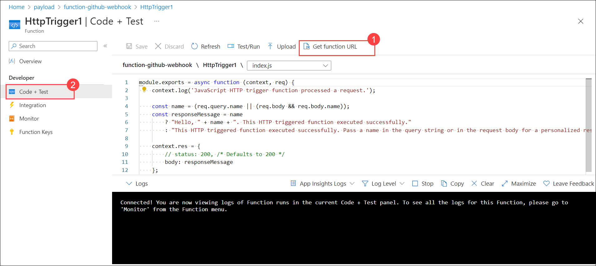

1. Navigate to your repository's, click  Settings.

   

1. Click on **webhook**.

   

1. Click on **Add Webhooks**. and give your github password.

1. On the webhook form displayed, paste the **Get Function URL** generated by the HttpTrigger into the **Payload URL (1)** field.

- **Content type**: Select **application/json (2)** so that you can receive the payload as a JSON object.
- **Secret**: You can leave this blank.
- **SSL verification**: Leave this as the default option of **Enable SSL verification (3)**.
- **Which events would you like to trigger this webhook?**: select the **Just the push event option (4)**.
- **Active (5)**: Leave this checked to receive event details when the GitHub webhook is triggered.
- Click on **Add Webhooks (6)**.

   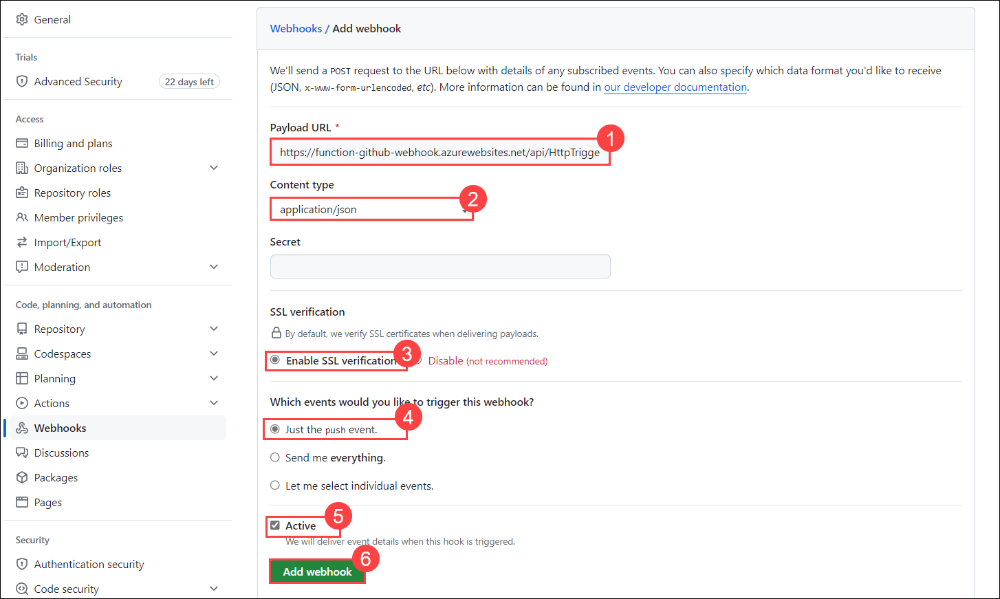

11. Now go to **Repositories** section and click on **New Respsitories**.

    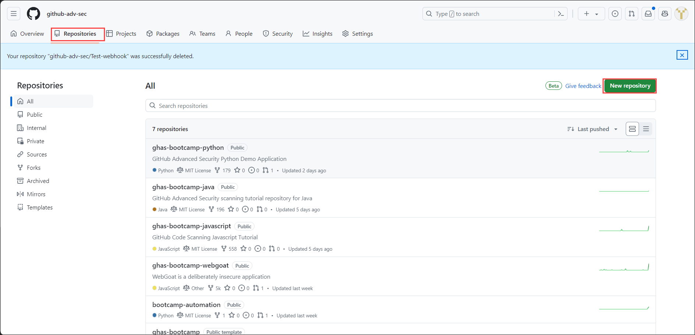

12. Give the **Repositories name** as **Test-webhook (1)**, select the **Public (2)** and click on the **Create repositories (3)** to create them.

    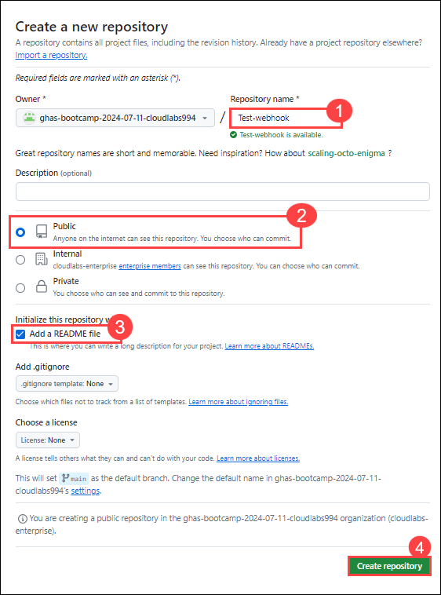
  
    >**Note**: you can made some more changes to you repositories, it will send the POST request to function app.

13. Navigate to your repository's, click settings.

     

14. Click on **webhook**, select the webhook you have created.

15. Scrool down to bottom and will find some **Recent Deliveries**.

    

16.  click to any deliveries. you will see their **Request** and **Response** column for more information.

     

     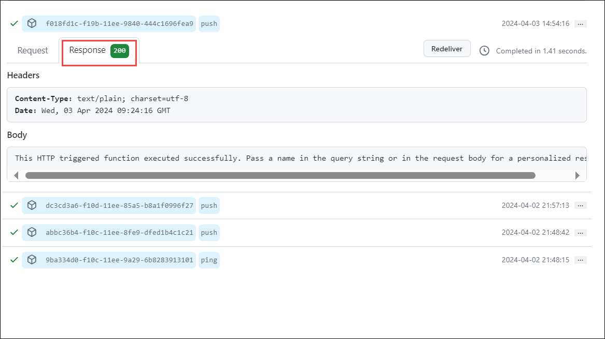

17. Navigate back to your Function app, Click on **Monitor (1)** under the **Developers** section, click on **Invocations (2)** here it will give the most recent invocation traces.

     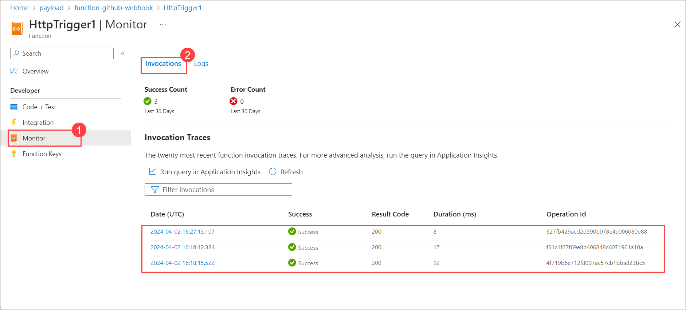
   
     >**Note:** It will take 5-7 minutes to show.

#### Task 4: Talk about repository rulesets and how they can be used at scale [ Read Only ]

1. A ruleset is a named list of rules that applies to a repository. You can create rulesets to control how people can interact with selected branches and tags in a repository. You can control things like who can push commits to a certain branch, or who can delete or rename a tag. For example, you could set up a ruleset for your repository's feature branch that requires signed commits and blocks force pushes for all users except repository administrators.

1. For each ruleset you create, you specify which branches or tags in your repository the ruleset applies to. You can use fnmatch syntax to define a pattern to target specific branches and tags. For example, you could use the pattern releases/**/* to target all branches in your repository whose name starts with the string releases/. 

1. When you create a ruleset, you can allow certain users to bypass the rules in the ruleset. This can be users with a certain role, such as repository administrator, or it can be specific teams or GitHub Apps.

1. There is a limit of 75 rulesets per repository.

#### Task 1: Creating rulesets for a repository

You can create rulesets to control how users can interact with selected branches and tags in a repository. When you create a ruleset, you can allow certain users to bypass the rules in the ruleset. This can be users with certain permissions, specific teams, or GitHub Apps.

1. **Creating a branch or tag ruleset** 

1. On GitHub, navigate to the main page of the repository.

1. Under your repository name, click  Settings. If you cannot see the "Settings" tab, select the **...**  dropdown menu, then click Settings.

     

1. In the left sidebar, under "Code and automation," click **Repository**, then click **Rulesets**

       

1. You can create a ruleset targeting branches, or a ruleset targeting tags.

   - To create a ruleset targeting branches, click **New branch ruleset**.
   - To create a ruleset targeting tags, select , then **click New tag ruleset**.

   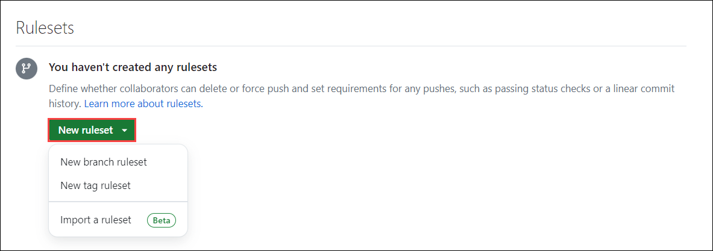  
  
1. In the "General" section, type a name for the ruleset, then select  Disabled  and click one of the following enforcement statuses:

   - **Active**: your ruleset will be enforced upon creation.
   - **Disabled**: your ruleset will not be enforced.

In summary, repository rulesets enhance security, compliance, and consistency across repositories, especially when managing large-scale projects. 

For more details, refer to the [GitHub documentation on rulesets](https://docs.github.com/en/repositories/configuring-branches-and-merges-in-your-repository/managing-rulesets/about-rulesets)
