# Module 06: Microsoft Defender for Cloud Integration

## Lab Scenario

In this lab, you will connect your GitHub account to Microsoft Defender for Cloud (formerly Azure Defender), enhance security monitoring and threat detection capabilities. 

## Lab Objectives
In this lab, you will perform:

- Task 1: Connect your GitHub account to Microsoft Defender for Cloud
- Task 2: Review GitHub Security Recommendations in Microsoft Defender for Cloud

## Estimated Timing: 20 minutes

## Architecture Diagram

   

## Task 1: Connect your GitHub account to Microsoft Defender for Cloud

Microsoft Defender for Cloud integrates with GitHub to provide enhanced security for your repositories. It offers continuous monitoring, identifies vulnerabilities, and provides actionable recommendations to help you remediate issues, ensuring your codebase remains secure and compliant.

1. In the search bar of the Azure portal, type **Defender (1)**. From the search results, select **Microsoft Defender for Cloud (2)**. 

   

1. This will navigate you to the **Overview** page of Microsoft Defender for Cloud dashboard. If prompted, select **Skip** to proceed directly to the main Microsoft Defender for Cloud dashboard.

   

1. In the Microsoft Defender for Cloud left menu, under **Management (1)**, select **Environment settings (2)**. Click **Add environment (3)** from the top, then choose **GitHub (4)** from the dropdown. Follow the prompts to connect your GitHub account and configure the environment settings.

   

1. On the **GitHub Connection** page, under **Account details**, provide the required settings as specified.

   | Setting  | Value |
   -----------|---------
   | Connector name | ghas-github **(1)** |
   | Resource group | Lab-VM **(2)** |
   | Location | East US **(3)** |
   
   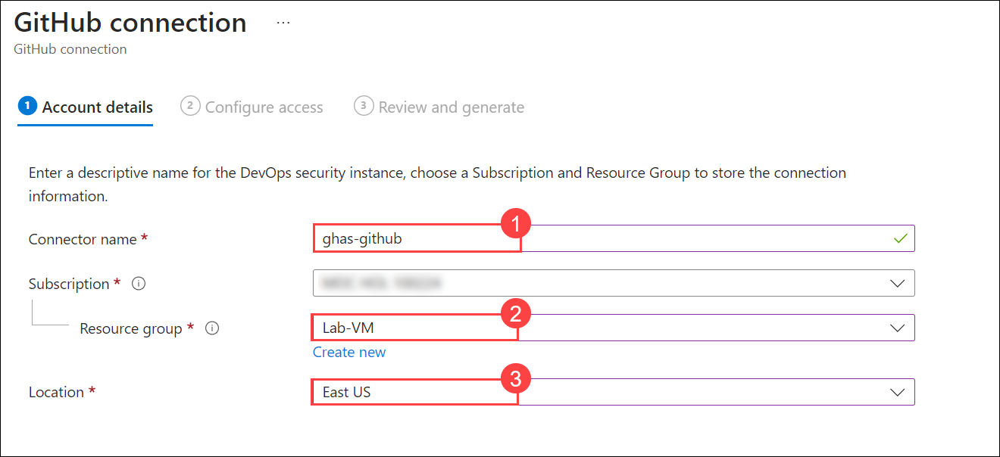

1. Select **Next: Configure access** to proceed to the next step.

1. Click the **Authorize** button to grant Microsoft Defender for Cloud access to your GitHub account.
       
   

1. If prompted, click on **Authorize Microsoft Security DevOps** to grant authorization.
   
   

1. After authorization is complete, click on **Install** under the **Install DevOps Security App** option to finalize the setup.
   
   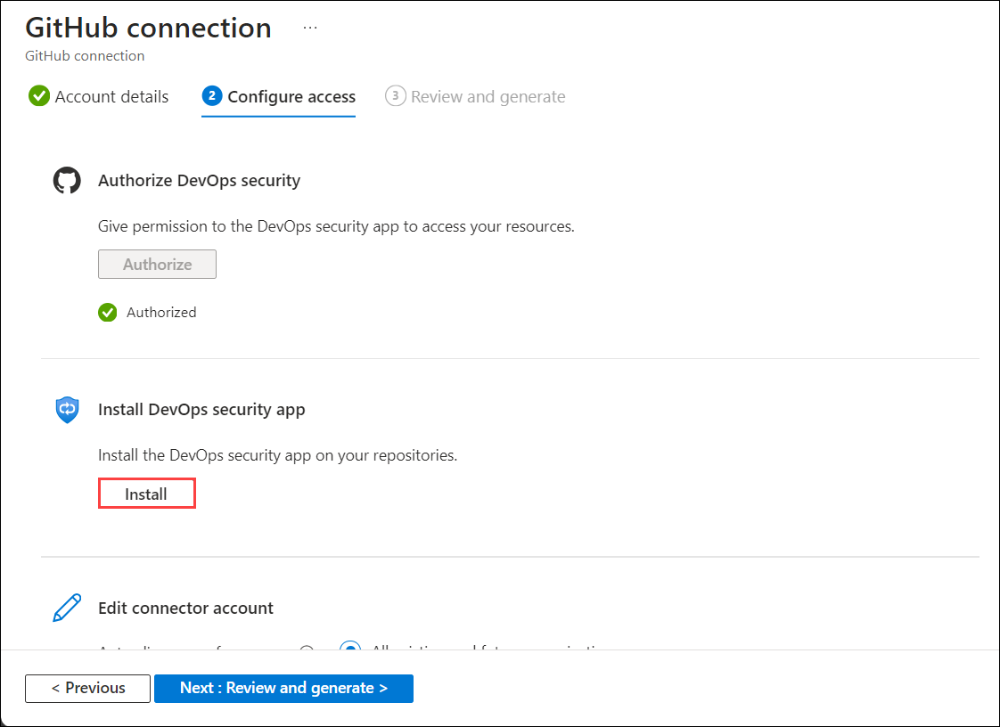

1. Select your GitHub organization for **All repositories** and click on **Install** to apply the integration.
   
   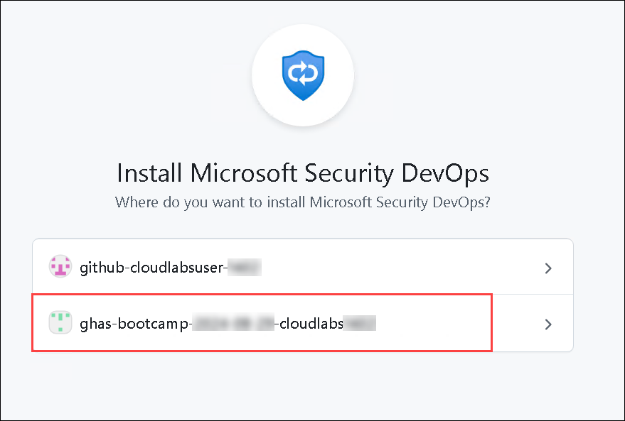
   
   

1. Click on **Next: Review and generate** to proceed to the final review.
   
   

1. Review your details and click on **Create** to finalize the setup and complete the integration process.

   
   
1. You will see the GitHub connector listed on the **Environment settings** page.
   
                     
   
   >**Note:** It takes around 15 minutes to arrive.

   > **Congratulations** on completing the task! Now, it's time to validate it. Here are the steps:
	
   - Hit the Validate button for the corresponding task. If you receive a success message, you can proceed to the next task. 
   - If not, carefully read the error message and retry the step, following the instructions in the lab guide.
   - If you need any assistance, please contact us at cloudlabs-support@spektrasystems.com. We are available 24/7 to help you out.

   <validation step="18b96a1a-7f72-4440-8d0b-ce63614a0abb" />

## Task 2: Review GitHub Security Recommendations in Microsoft Defender for Cloud (Read-Only)

This task has been set to Read-Only because addressing the security findings in Microsoft Defender for Cloud will take approximately 8 hours.

1. In Microsoft Defender for Cloud, navigate to the **Recommendations** section. Here, you will find the recommendations related to GitHub. These recommendations will provide insights and best practices to enhance the security and compliance of your GitHub repositories integrated with Azure services.

   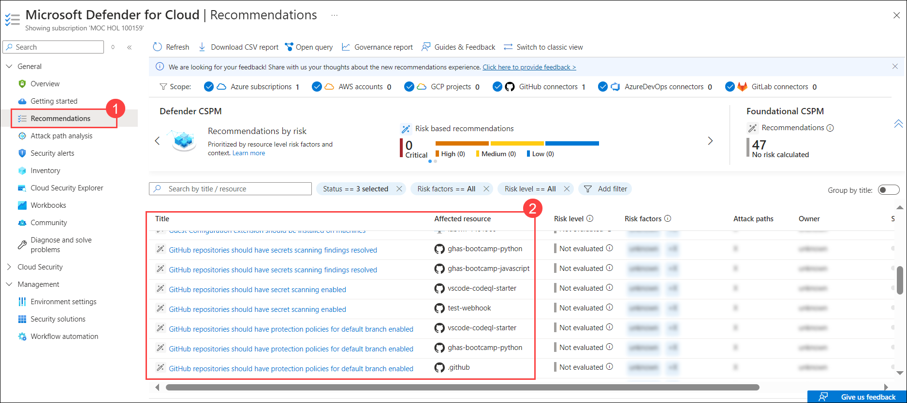

    >**Note**: It may take up to 8 hours for the changes to be reflected, and there is a possibility that you may receive different recommendations.

1. Navigate to each recommendation for detailed insights and actionable steps provided by Microsoft Defender for Cloud. Review the remediation section to explore potential vulnerabilities and their resolutions.

   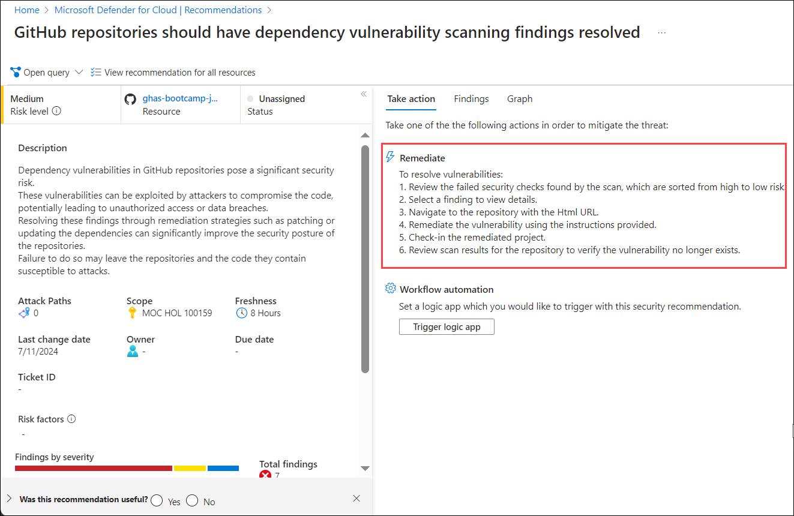

1. Now click on the **Findings** tab (1). Here, you will see a comprehensive list of security alerts that have been detected. Select any alert to access detailed information, including:

	- **Description**: An explanation of the issue and how it was detected.
	- **Severity**: The level of threat posed by the vulnerability, helping you prioritize your response.
	- **Additional Information**: Further details, to help you understand and address the issue effectively.
         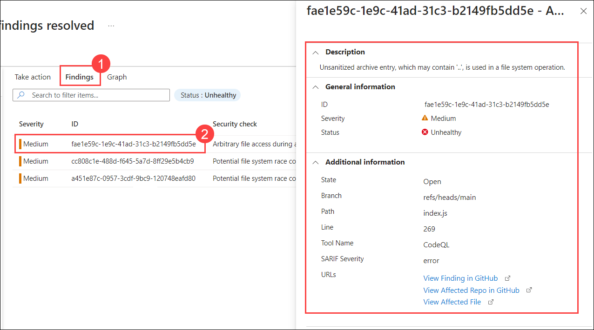

1. Now, navigate back to your Defender for Cloud dashboard. Under the **Cloud Security** section (1), click on **DevOps security** (2). Here, you will find all your GitHub repositories. Click on **ghas-bootcamp-webgoat** (3) to view the recommendations and alerts associated with this repository.

   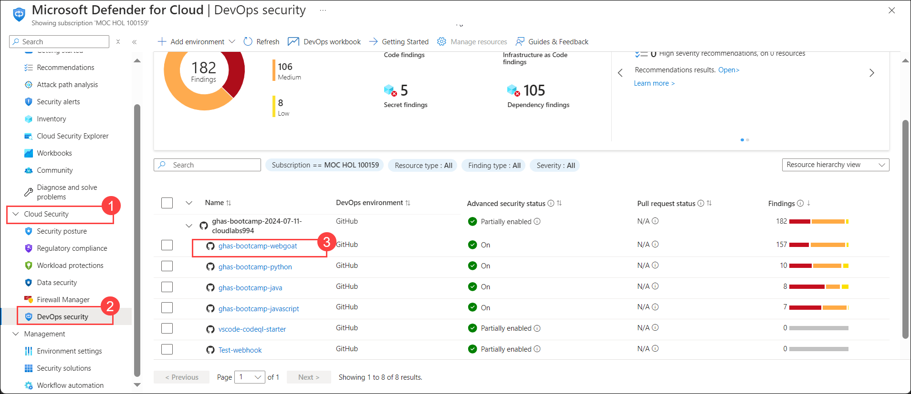

   >**Note:** You can review all your repositories to see their recommendations and alerts.

1. In the **Recommendations** section (1), click on **GitHub repositories should have code scanning findings resolved** (2). This will provide you with specific recommendations for addressing code scanning issues.

   

1. Here, you can review the **Description** to understand the nature of the issue. Click on **Remediate** to get detailed information on possible resolutions and steps to mitigate the vulnerability.

   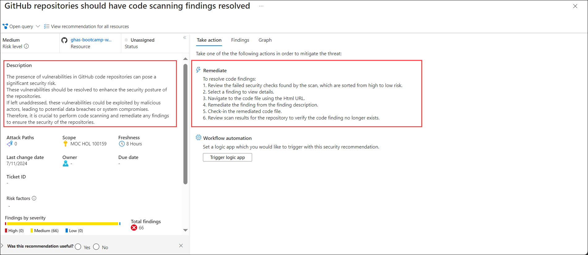

1. Now, click on the **Findings** tab (1). Here, you can find the security checks performed by GitHub related to code scanning. These findings provide detailed insights into the identified vulnerabilities.

   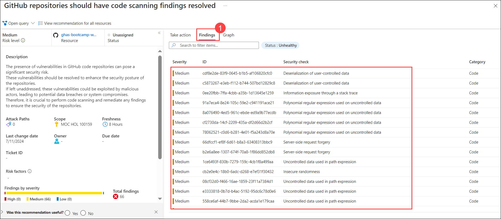

1. Click on any one of the findings to get its detailed **Description**, general information like **Severity**, and additional information. This will help you understand the issue in depth and take appropriate actions.

   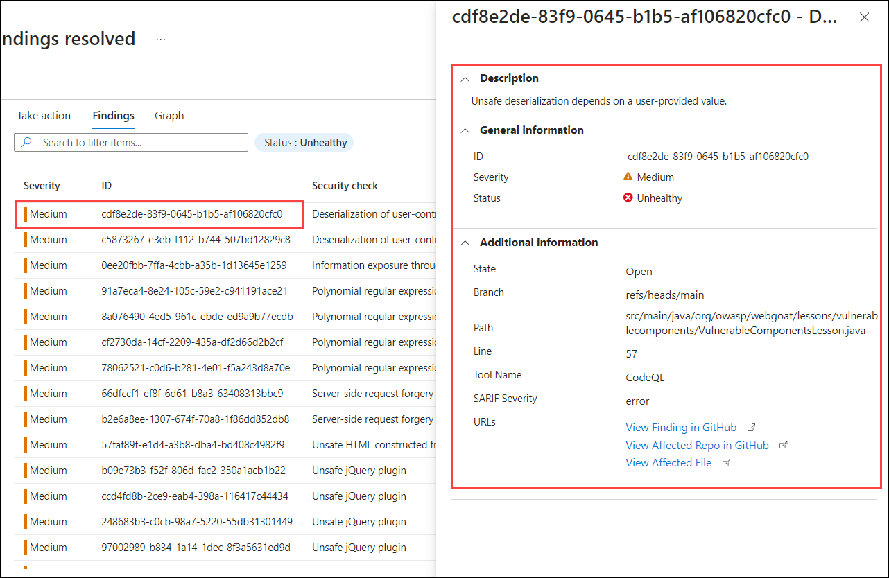

1. Now, navigate back to your GitHub account and go to the **ghas-bootcamp-webgoat** repository. Click on the **Security** tab (1) and then go to the **Code scanning** alerts (2). Here, you will find all the alerts related to secret scanning. These results should match the security alerts reflected in your Defender for Cloud.

   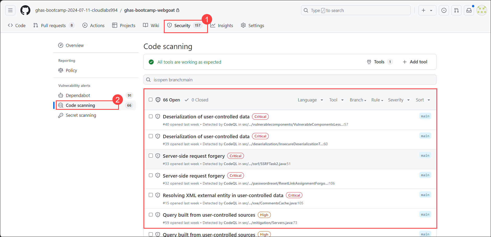

Please feel free to go through the below links for further understanding:

1. [Public Roadmap](https://github.com/orgs/github/projects/4247/views/6)
2. [Application Security](https://info.microsoft.com/US-DevOps-VDEO-FY24-02Feb-12-GitHub-and-AI-A-Powerful-Duo-for-Application-Security-Testing-SRGCM11732_LP01-Registration---Form-in-Body.html)
3. [Application Security Testing](https://www.microsoft.com/en-us/industry?rtc=1)
4. [Introducing AI-powered application security testing with GitHub Advanced Security](https://github.blog/2023-11-08-ai-powered-appsec/)

## Review

In this lab, you have completed the following:
+ Connected your GitHub account to Microsoft Defender for Cloud
