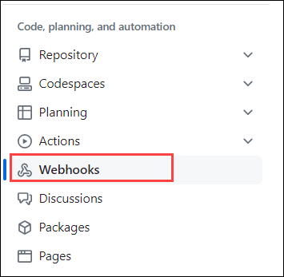

#### Task 3.1: Installing necessary tools.

1. Search for **PowerShell** in the Windows search, select **PowerShell ISE**, and **Run as administrator**.

    
   
1. Paste the following commands to install ***nodejs (1)*** and click on the **Run (2)** button.

     ```
    #Install nodejs v16.8.0
    $WebClient = New-Object System.Net.WebClient
    $WebClient.DownloadFile("https://nodejs.org/download/release/v16.8.0/node-v16.8.0-x64.msi","C:\node-v16.8.0-x64.msi")
    $arguments = "/i `"C:\node-v16.8.0-x64.msi`" /quiet"
    Start-Process msiexec.exe -ArgumentList $arguments -Wait
    sleep 5
      ```

    

1. To install **Scoop**, copy the following command and paste it into the PowerShell editor, highlight the **code**, and click on **Run**.

      ```
      iex "& {$(irm get.scoop.sh)} -RunAsAdmin"
      ```

     

1. To install **git**, copy the following command and paste it into the PowerShell editor, highlight the code, and click **Run**.

      ```
      $WebClient = New-Object System.Net.WebClient
      $WebClient.DownloadFile("https://github.com/git-for-windows/git/releases/download/v2.44.0.windows.1/Git-2.44.0-64-bit.exe","C:\Git-2.44.0-64-bit.exe")
      $arguments = "/VERYSILENT /NORESTART /NOCANCEL /SP-"
      Start-Process "C:\Git-2.44.0-64-bit.exe" -ArgumentList $arguments -Wait
      sleep 5
      ```

      

#### Task 3.2: Clone a demo API server for receiving GitHub webhooks

1. Start **Visual Studio Code** from the desktop.

    

1. In the Visual Studio Code terminal, click on **(...) (1)**, select **Terminal (2)**, and then select **New Terminal** (3). The terminal window usually opens in the lower half of your screen.

    
    
1. Clone the repository by running the following command:

      ```
      git clone --single-branch --branch github-webhooks https://github.com/hookdeck/nodejs-webhook-server-example.git
      ```

1. Navigate to the root of the project and install the required dependencies by running the following commands:

      ```
      cd nodejs-webhook-server-example
      ```

      ```
      npm install
      ```
      ```
      npm start
      ```
      
    
   
   >**Note:** This will boot up the API application and print a message to the screen indicating that the API is now running and listening for connections on port 1337.
   
#### Task 3.3: Get the webhook URL

1. Install the hookdeck by running the following commands.

      ```
      scoop bucket add hookdeck https://github.com/hookdeck/scoop-hookdeck-cli.git
      ```
      ```
      scoop install hookdeck
      ```

1. To allow traffic on port 1337

      ```
      netsh interface portproxy add v4tov4 listenport=1337 listenaddress=0.0.0.0 connectport=1337 connectaddress=127.0.0.1
      ```

1. To verify that the port is listening, you can use the following command:

      ```
      netstat -an | findstr "1337"
      ```
      
1. Once the setup process is complete, the next step is to use the CLI to generate a Webhook URL that points to the running API application.

      ```
      hookdeck listen 1337
      ```

1. This command starts an interactive session where the CLI collects information about the endpoint you're about to create. Below are the questions and the answers you should supply to each question.

    | Question | Answer |
    | -- | -- |
    | **What source should you select?** | Select **Create new source** |
    | **What should your new source label be?** | Type the text **Github** |
    | **What path should the webhooks be forwarded to (i.e.: /webhooks)?** | Type **/log-github-webhook** |
    | **What's the connection label (i.e.: My API)?** | Type **My Github Response Server** |

1. With this information, the CLI will begin the process of generating the URL, and once it's done, you will see the URL printed on the screen. The CLI indicates that it is ready to receive requests.

    

1. Now copy and paste the **Inspect and replay webhooks** URL into your browser.

    

1. Copy the URL.

    
   
1. Navigate to your repository and click on **Settings**.

   

1. Click on the **Webhooks** option.

   

1. Click on **Add Webhooks**, and enter your GitHub password.

1. On the Webhooks form displayed, paste the Webhooks URL generated by the Hookdeck CLI into the **Payload URL (1)** field.

- **Content type**: Select **application/JSON (2)** so that you can receive the payload as a JSON object.
- **Secret**: You can leave this blank.
- **SSL verification**: Leave this as the default option of **Enable SSL verification (3)**.
- **Which events would you like to trigger this webhook?** Select the **Just the push event option (4)**.
- **Active (5)**: Leave this checked to receive event details when the GitHub webhook is triggered.
- Click on **Add Webhooks (6)**.

     
    

13. On the **Console page** on the web, it will offer the **Accepted** status of your webhooks.

    

    >**Note**: It will take 3-5 minutes to show the status.

